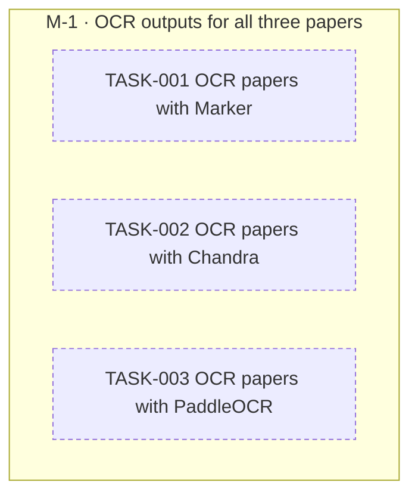

# OCR three papers with four methods

Goal `ocr-papers` · format `goal/v2`. Live status is derived from GitHub and git and is
never written here: run `goal status ocr-papers` or `goal tui`.

Produce machine-readable text for all three PDFs using Marker, Chandra, PaddleOCR, and paperextract.

## Context, scope and non-goals

The repo holds three PDF papers on leveraged ETF rebalancing and volatility. Each OCR method writes plain-text or Markdown output under `ocr/<method>/`, one file per paper, same base name. No text cleanup, no comparison report, and no accuracy scoring are in scope. Assumption: each tool runs locally from its public repo docs with default settings.

## Risks and open questions

Tools may need heavy models, GPU access, or API keys. Scanned tables and math may convert poorly. Open question: which output format each tool produces by default (Markdown or text).

## Plan structure

<!-- goal:graph:start -->

<!-- goal:graph:end -->

## Worker protocol

For an agent executing exactly one task of this goal:

1. Work only on your task, in your own branch and worktree, branched from `origin/main`.
2. Read `tasks/TASK-NNN.md` (the spec), the outcomes of the tasks it depends on, and the
   accepted decisions it depends on. Never edit specs, other tasks, decisions or `goal.yaml`.
3. After your first commit, open a draft PR into `main` whose body contains the line
   `Goal-Task: ocr-papers/TASK-NNN`. Write the body with real newlines.
   Use `gh pr create --body-file FILE` or `gh pr edit --body-file FILE`.
4. Do the work and run the spec's Verify commands.
5. Write `tasks/TASK-NNN.outcome.md` with an `## Acceptance` checklist (each item followed by
   its evidence) and a `## Summary` (what, how, deviations, verified revision, proposed
   follow-ups). Commit it in the same PR.
6. Mark the PR ready for review when checks pass or none are configured.
   Failing or pending checks block delivery. Never merge.
7. Blocked by a missing decision, access or data? Explain it in the outcome, add the line
   `Goal-Blocked: <reason>` to the draft PR body, and stop. For a material decision, also
   write `## Decision request` in the outcome with the question, options and trade-offs,
   and your recommendation under `### Recommendation` (omit it if you have none). Add
   `Goal-Decision: <one-line question>` to the draft PR body, commit and push, then stop
   through exit (B). Refresh or `goal sync` creates a decision in the Inbox. Under
   `decide: experts`, the committee advises. Under `orchestrate: agent`, the
   orchestrator accepts or rejects it; otherwise the human does. After acceptance,
   the Resume task action in `:` resumes the task with the decision in its resume note.
