## Page 1

Charles A. Dice Center for  
Research in Financial Economics  
 
 
The Unintended Consequences 
of Rebalancing 
 
 
 
 
 
 
 
Campbell R. Harvey, 
 
Duke University and NBER 
 
Michele G. Mazzoleni,  
 
Capital Group 
 
Alessandro Melone, 
 
The Ohio State University  
Dice Center WP 2025-01 
Fisher College of Business WP 2025-03-001 
 
January 14, 2026 
 
 
An index to the working paper in the Fisher College of Busi-
ness Working Paper Series is located at:   
http://www.ssrn.com/link/Fisher-College-of-Business.html 
fisher.osu.edu 
Fisher College of Business 
Working Paper Series

## Page 2

The Unintended Consequences of Rebalancing*
Campbell R. Harvey„
Michele G. Mazzoleni…
Alessandro Melone§
January 14, 2026
Abstract
Institutional investors engage in trillions of dollars of regular portfolio rebalancing, often based
on calendar schedules or deviations from allocation targets. We document that such rebalancing
has a market-wide impact and generates predictable price patterns. When stocks are overweight,
funds sell stocks and buy bonds, leading to a decrease in equity returns of 17 basis points over
the next day. Our results are robust to controls for momentum, reversals, and macroeconomic
information. Importantly, we estimate that current rebalancing practices cost investors about $16
billion annually – or $200 per U.S. household. Moreover, the predictability of these trades enables
certain market participants to profit by front-running the orders of large institutional funds. While
rebalancing remains a fundamental tool for investors, our findings highlight the costs associated
with prevailing strategies and emphasize the need for innovative approaches to mitigate these costs.
Keywords: Rebalancing, Institutional Investors, Return Dynamics, Price Pressures, Reversal.
JEL codes: G11, G12, G23.
*We thank Aleksandar Andonov, Philippe van der Beck, Zahi Ben-David, Hank Bessembinder, Andrea
Buffa, Aditya Chaudhry, Huaizhi Chen (discussant), Zhi Da (discussant), Magnus Dahlquist, Kent Daniel
(discussant), Valentin Haddad (discussant), Paul Huebner, Kristy Jansen, Greg Kadlec, Paymon Khor-
rami, Antonia Kirilova (discussant), Federico Mainardi, Jim Masturzo, Lira Mota, Christian Opp, Jonathan
Parker (discussant), Taisiya Sikorskaya, Amar Soebhag, Ren´e Stulz, Matti Suominen (discussant), Costanza
Torricelli (discussant), Stijn Van Nieuwerburgh, Fernando Zapatero, as well as seminar and conference par-
ticipants at Cornell University, Carnegie Mellon University, University of Oxford, Georgia State University,
The Ohio State University, Einaudi Institute of Economics and Finance, European Securities and Markets
Authority, Council of Institutional Investors, CFA UK, Vanguard, Bloomberg, INQUIRE Europe, the AFA
2026 Annual Meeting, the NBER Asset Pricing Spring 2025 Meeting, the CEPR Paris Symposium 2025, the
Red Rock Finance Conference 2025, the SFS Cavalcade 2025 Annual Meeting, the Imperial College Hedge
Fund Conference 2025, the Isenberg Finance Conference 2025, the Esade Spring Workshop 2025, and the
LTI-Bank of Italy Workshop 2025 for helpful comments and discussions. The views expressed in this article
are those of the authors and do not necessarily reflect those of Capital Group.
„Fuqua School of Business, Duke University and NBER. E-mail: cam.harvey@duke.edu.
…Capital Group. E-mail: mazzoleni.research@gmail.com.
§Fisher College of Business, The Ohio State University. E-mail: melone.11@osu.edu.

## Page 3

“JPMorgan Says Stocks to Suffer $150 Billion Rebalancing Sales”
Bloomberg (June 15, 2023)
“Pension Rebalancing Threatens to Spur $26 Billion Equity Selloff ”
Bloomberg (September 29, 2022)
“Big investors to shift billions from bonds into stock markets”
Financial Times (March 11, 2022)
Introduction
For more than three decades, investment managers have employed regular rebalancing –
selling stocks and purchasing bonds when equities outperform bonds, and vice versa – as a key
strategy to align portfolio weights with their target allocations.1 Although this rebalancing
activity is often perceived as a significant driver of aggregate price fluctuations, the academic
literature has only recently begun to investigate whether and why this is the case.
For
example, Parker, Schoar, and Sun (2023) find that, while rebalancing by target date funds
(TDFs) influences the cross-sectional pattern of returns across stocks, the aggregate effects
are likely to be negligible given the current size of TDFs. However, most investors – including
pension, sovereign wealth, and mutual funds – have relatively tight mandates and maintain
stable asset shares (see, e.g., Gabaix and Koijen, 2021). Therefore, as prices fluctuate over
time, these funds must buy losers and sell winners, which indicates a potentially broader
and stronger rebalancing impact on aggregate dynamics.
In this paper, we study the market-wide economic implications of rebalancing. While
rebalancing is a core strategy for maintaining portfolio diversification and managing liquid-
ity, our results highlight that existing rebalancing policies induce significant predictability,
costing investors billions of dollars every year. Furthermore, mechanical rebalancing enables
certain traders to front-run the predictable orders of large funds, generating significant risk-
adjusted profits. A key challenge in studying rebalancing is that institutional policies are
heterogeneous and partially unobserved. Some investors rebalance quarterly, others monthly
or even daily, and many adjust their portfolios only when asset weights deviate sufficiently
from target allocations. Rather than attempting to measure exact individual rebalancing
strategies, we adopt a time-series approach that captures common rebalancing incentives
implied by realized asset returns. This “macro identification” strategy allows us to uncover
systematic and predictable components of rebalancing activity shared across institutional
investors and to study their implications for asset prices.
1See, e.g., Perold and Sharpe (1988) for an early contribution on rebalancing.
1

## Page 4

To develop comprehensive measures of rebalancing activity, we analyze weight deviations
in balanced equity–bond portfolios. Specifically, consider a portfolio with 60% of its capital
invested in the S&P 500 Index and 40% in 10-year U.S. Treasury note. We calculate weight
deviations of this simulated 60/40 portfolio using daily futures returns during the period
1997–2023. When stocks outperform bonds, they become overweight, and rebalancers must
sell stocks and buy bonds to realign portfolio weights to their target allocations. Thus, weight
deviations represent a natural proxy for rebalancing activities: the larger the deviation, the
greater the likelihood and the potential magnitude of rebalancing.
We compute weight deviations from portfolio targets using two rule-based rebalancing
approaches, Threshold and Calendar, that reflect the investment policies of different in-
stitutions. The Threshold (or state-dependent) approach adjusts positions when portfolio
weights exceed predetermined distances from targets, reflecting the idea that allowing for
portfolio drifts within defined ranges helps minimize transaction costs. Furthermore, many
institutional investors have regular cash flow needs at the beginning of every month (see, e.g.,
Etula, Rinne, Suominen, and Vaittinen, 2020). For example, mature pension funds often sell
assets at month-end to raise cash for member benefit payments. The Calendar approach
captures these scheduled rebalancing activities and can be viewed as a time-dependent re-
balancing. Because Threshold and Calendar signals are measured with noise, they should
be interpreted as capturing the likely direction and magnitude of rebalancing activity. Im-
portantly, because trading activity is naturally coordinated in both direction and timing by
past returns, such rebalancing may generate price impact. Both rebalancing signals are easy
to compute, available in real-time, and applicable for any frequency with available return
data.
Using these rebalancing signals, we provide novel evidence on U.S. aggregate price dy-
namics related to rebalancing activities. We find a one-standard-deviation increase in the
Threshold (Calendar) signal leads to a decrease in equity returns of approximately 16 ba-
sis points (bps) (17 bps) and an increase in bond returns of about 4 bps (2 bps) over the
next trading day. Rebalancing pressures revert almost entirely within two weeks, consistent
with the fact that rebalancing is a by-product of institutional investors’ mandates that likely
conveys little information about market fundamentals. Our results are robust to including
controls for momentum, reversals, macroeconomic activity, and sentiment indicators. We
2

## Page 5

argue that these results are conservative. Without actual daily trades from all rebalancers,
our rebalancing signals only proxy for a representative rebalancer’s activity. Consequently,
the documented effects likely underestimate the true impact we would observe if we knew
the precise timing of individual investors’ rebalancing activities.
A back-of-the-envelope calculation using our predictability results estimates that the re-
balancing costs borne by institutional investors can exceed 8 bps per year. For a market
potentially exceeding $20 trillion in size, rebalancing pressures could translate into an annual
cost of $16 billion, or about $200 per U.S. household each year. To put these numbers in
perspective, these costs are higher than those institutional investors pay to invest passively
across equity and bond markets. In other words, rebalancing a balanced equity–bond port-
folio might cost more than the fees to access those markets in the first place. Moreover, since
rebalancing costs recur annually, their true present value is substantially larger. At the same
time, we show that simple randomization in rebalancing schedules – all else being equal –
largely eliminates these costs, underscoring that much of this burden arises from mechanical
rebalancing pressures.
We leverage four datasets to link our rebalancing signals to actual quantities. First, we
use weekly CFTC futures positions and show that hedgers sell (buy) equities when they are
overweight (underweight) relative to bonds. We then exploit CFTC’s weekly Large Trader
Net Position Changes and ANcerno’s daily data on institutional equity transactions, which
reveal that asset managers and pension funds act as rebalancers. Finally, ICI mutual fund
flows show that mutual funds sell equities and buy bonds when equities become overweight.
Taken together, these diverse sources suggest that institutional investors’ trading behavior
is broadly consistent with our interpretation.
We conduct several additional analyses to validate the economic interpretation of our
rebalancing signals. First, we identify seasonal patterns in the predictability of the Thresh-
old and Calendar signals, observing that Calendar predictability is strong at month-end but
absent at other times and that the predictive power and economic significance of both sig-
nals increase as the quarter-end approaches. These patterns are consistent with month- or
quarter-end trades motivated by liquidity needs or benchmark tracking, rather than risk or
behavioral factors. Second, we demonstrate that our signals predict equity and bond excess
returns with opposite signs, indicating trades in both markets consistent with our interpre-
3

## Page 6

tation. Third, we find that the predictive power of these signals became significant in the
early 2000s, which reflects changes in pension fund allocations, cash flow demands, and 2006
legislation affecting the TDF industry. Fourth, we show that our rebalancing predictions
apply to large- and small-cap stocks but not to value and growth stocks, aligning with funds
targeting specific equity market segments. Finally, we document that the Threshold and
Calendar signals also extend to international equity markets.
Finally, mechanical rebalancing offers certain investors the opportunity to front-run the
predictable trades of large funds. To explore the potential economic value of these front-
running strategies, we construct a managed portfolio that replicates the trades of an investor
anticipating rebalancing activities. This portfolio uses our Threshold and Calendar signals
to develop a cross-asset trading strategy. This strategy involves taking either a long position
in S&P 500 futures while shorting 10-year Treasury note futures, or vice versa, based on
the rebalancing signals. The managed portfolio constructed using these rebalancing signals
delivers significant positive alphas and achieves a Sharpe ratio exceeding 1 over the 1997 to
2023 sample period.
Our work contributes to a growing literature on the effects of rebalancing by institutional
investors.2 Da, Larrain, Sialm, and Tessada (2018) document market-wide price pressure for
stocks and bonds in Chile following recommendations for asset reallocation. Camanho, Hau,
and Rey (2022) show that aggregate fund flows prompted by global portfolio rebalancing
affect exchange rate dynamics. Peng and Wang (2023) document that mutual funds have
persistent factor demand that forces them to frequently rebalance their portfolios’ factor
exposures, which leads to predictable stock-level trading and price pressure. Parker, Schoar,
and Sun (2023) demonstrate that rebalancing by TDFs influences the fund flow patterns
across mutual funds and the cross-sectional patterns of returns across stocks. Andonov,
Eiling, and Xu (2024) extend the TDFs evidence to international capital markets, showing
that these funds frequently engage in contrarian rebalancing between domestic and foreign
equities. Chen (2025) shows that active mutual funds rebalance their portfolios by selling
shares in recently well-performing positions, in line with diversification and risk management
motives.
Parker and Sun (2025) document that trading by TDFs acted as a significant
stabilizing force in U.S. equity markets during the COVID-19 pandemic. Lu and Wu (2025)
2Buffa, Vayanos, and Woolley (2022) provide a theoretical model to study the equilibrium effects of
rebalancing.
4

## Page 7

find that rebalancing pressures play a significant role in the transmission of monetary shocks
to the stock market. Sammon and Shim (2026) find that index funds incur adverse selection
costs from rebalancing in response to stock market composition changes, buying at high
prices when firms issue shares and selling at low prices when firms repurchase them. Our
paper provides the first evidence of aggregate price effects for U.S. stocks and bonds arising
from portfolio rebalancing activity.
This paper is also broadly related to the literature on price pressures. Since the work of
Shleifer (1986) and Harris and Gurel (1986), an important strand of the literature has fo-
cused on event studies (e.g., index inclusion or new regulations) to understand cross-sectional
price patterns; however, the literature has only recently started to explore potential aggre-
gate price effects.3
If aggregate demand is inelastic, shifts in institutional demand can
generate large price impact (Koijen and Yogo, 2019; Gabaix and Koijen, 2021; Pavlova and
Sikorskaya, 2023). Li, Pearson, and Zhang (2021) document that flows based on IPO regu-
lations influence the Chinese aggregate stock market. Jansen (2021) investigates the effect
of long-term investors demand shifts on government bond yields. Bretscher, Schmid, Sen,
and Sharma (2025) study the price impact of demand shocks for the corporate bond mar-
ket both for large institutions and at the aggregate level. Haddad, Huebner, and Loualiche
(2025) find that the rise of passive investing over the last 20 years has lowered the elasticity
of aggregate demand. Most closely related to our paper, Hartzmark and Solomon (2025)
find that uninformed, predictable buying pressures from dividend payments are associated
with higher aggregate market returns. In addition, Chen, Noronha, and Singal (2006) and
Petajisto (2011) find that index funds incur substantial costs due to mechanically buying
stocks at elevated prices following index inclusion and selling them at depressed prices after
index deletion. Our contribution is to show that mechanical rebalancing exerts a significant
market-wide price impact. We then use our regression estimates to quantify the economic
costs of current rebalancing activity.
The paper is organized as follows. In the next section, we provide institutional details on
3Warther (1995) and Edelen and Warner (2001) are two notable early contributions documenting a
positive relationship between aggregate flows and concurrent aggregate market returns. Another interesting
early paper is Ritter and Chopra (1989), who attributes the turn-of-the-year effect – the fact that returns on
small firms are unusually high in January – to buying pressure from individuals reinvesting the proceeds of
December’s tax-motivated sales and from institutional investors shifting their portfolio allocations to small,
risky stocks after year-end window dressing.
5

## Page 8

rebalancing and construct our return-based rebalancing proxies. Section 2 presents our main
evidence on the relationship between rebalancing activities and aggregate price dynamics.
In Section 3, we conduct several validation analyses for the economic interpretation of our
rebalancing signals. Section 4 uses rebalancing signals to construct a portfolio that exploits
market reversals.
Section 5 discusses both the costs and benefits of rebalancing.
Some
concluding remarks are offered in the final section.
1
Rebalancing: Motivation, Measurement, and Inter-
pretation
1.1
Evidence on Institutional Rebalancing Practices
We define rebalancing as the activity of selling recent winners and buying recent losers to
restore portfolio weights to their target allocations. In a multi-asset context, a 60/40 equity–
bond portfolio is a commonly employed target asset allocation; for an early reference, see
Ambachtsheer (1987), and for a more recent discussion, see Rattray, Granger, Harvey, and
Van Hemert (2020). For example, large pension plans and sovereign wealth funds commonly
target the 60/40 asset mix (e.g., Chambers, Dimson, and Ilmanen, 2012). Also, Gabaix
and Koijen (2021) document that, on average, pension funds hold 60% in equities. Target
allocations can be derived from theoretical considerations – such as TDF glide paths – or
can be decided by investment committees based on multiple inputs, as with public pension
funds.
As the value of risky assets fluctuate over time, so do their relative allocations or weights
within a portfolio. This simple observation carries important asset management implications.
In fact, most institutional investors, such as pension funds or mutual funds, are expected –
as stipulated by their investment policies – to maintain their asset weights within certain
ranges.4 For example, Figure 1 in Gabaix and Koijen (2021) documents that the relative
4Rebalancers include various institutional investors, such as public and private pension funds, endow-
ments, sovereign wealth funds, asset managers, and wealth managers. In the U.S. retirement industry, as
of year-end 2022, DB plans, defined contribution (DC) plans, and individual retirement accounts (IRAs)
held $37.8 trillion, according to data from the Federal Reserve’s Financial Accounts database. Other types
6

## Page 9

equity share in the portfolios of institutional investors remains relatively stable over time. Figure 1 complements these findings by focusing on U.S. defined benefit (DB) pension funds. Over the last two decades, the relative allocations to public equity and fixed income have closely tracked their stated targets, resembling the classic 60/40 portfolio and suggesting that public pension funds must regularly engage in rebalancing.

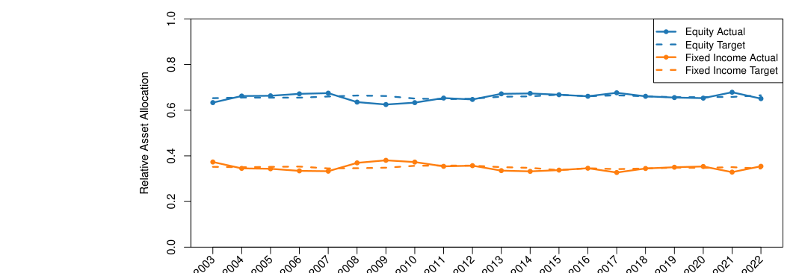

<!-- Image (140, 270, 822, 493) -->

**Figure 1: U.S. Defined Benefit Pension Funds' Asset Allocation Over Time.** This figure shows the average relative allocations by fiscal year across U.S. defined benefit pension funds produced by the Center for Retirement Research at the Boston College and available at Public Plans Data. Equity allocations include investments in domestic and international public equity markets. Fixed income includes cash allocations in addition to bonds. Relative allocations are computed by normalizing portfolio weights for the sum of equity and fixed income allocations. As of the end of fiscal year 2022, public equity and fixed income allocations amounted to about 64% of total portfolio weights. Annual observations. The sample period is 2003 to 2022.

Rebalancing frequency varies across investor types and often reflects cash flow management. For instance, pension funds, which typically face greater outflows than inflows, tend to rebalance at month-end to raise capital for benefit payments (e.g., Etula et al., 2020). Mutual funds, by contrast, experience continuous inflows and outflows and may rebalance daily to adjust allocations, e.g., by deploying inflows into underweight assets. ${}^{5}$

of asset owners may also have an influence. Among sovereign wealth funds, the Norges Bank Investment Management, which targets approximately a 70/30 equity-bond portfolio, alone held slightly more than 1% of the U.S. stock market at the end of year 2023. U.S. university endowments also accounted for almost $1 trillion at the end of fiscal year 2021, holding about 0.5% of the stock market assuming a 25% allocation to U.S. public equities, according to data from the National Center for Education Statistics.

${}^{5}$For example, a prospectus for a BlackRock balanced fund reports: "(...) the Fund's portfolio may be

## Page 10

Benchmark design also shapes rebalancing practices, as managers seeking to minimize
tracking error often align with their benchmark’s schedule. Practices can vary: Vanguard’s
TDF benchmarks used to rebalance daily, the S&P 500 Target Date Index series monthly, and
the Morningstar Target Risk Series quarterly.6 Rebalancing is often implemented through
derivatives such as futures and swaps.
Evidence from public pension plans provides additional insights into institutional prac-
tices. A Seattle City Employees’ Retirement System memo (September 2020) reports that
most rebalancing is conducted “synthetically” by an overlay manager using futures tied to
major equity benchmarks (e.g., S&P 500, MSCI EAFE) and U.S. Treasuries, with peri-
odic use of physical securities to adjust notional exposure. The overlay manager noted that
most clients rebalance at month-end to minimize tracking error versus benchmarks – also
rebalanced monthly – or within a few days of month-end to align with external cash flows.
Similarly, a Sacramento County Employees’ Retirement System memo (February 2024) de-
scribes how State Street Global Advisors rebalances the total fund through a hybrid approach
combining calendar- and threshold-based rules: rebalancing occurs quarterly at quarter-end
unless tolerance bands are breached mid-quarter. A February 2018 San Francisco Employees’
Retirement System memo highlights the role of tolerance bands, cash flows, and tracking
error in overlay program design, while a 2015 Montgomery County Public Schools memo
documents a month-end overlay-based rebalancing policy.7
These institutional case studies are in line with broader survey evidence and related
empirical research. According to a recent survey of rebalancing policies conducted by the
National Association of State Retirement Administrators (NASRA) – a national organiza-
tion with over 50 members representing $3.5 trillion in AUM – all public pension funds in
the survey use either a predetermined schedule rebalancing policy, a threshold-based ap-
proach triggered when an allocation range is breached, or a combination of the two (see
NASRA). Related discussions on the merits of different rebalancing approaches appear in
brought closer to the Fund’s target asset allocation either through the direction of daily cash flows to suitable
underlying funds or by interim rebalancings” (see SEC report).
6For example, as Vanguard reports in relation to its TDFs: “In practice, we first use daily cash flows
to maintain portfolio level allocations. If daily cash flows are insufficient to bring the portfolios within the
Threshold band of the target asset allocation, we then buy and sell securities to realign the funds’ asset
allocation back with the target” (see Vanguard).
7Documentation can be found here: SCERS; SFERS; and Montgomery.
8

## Page 11

research by Meketa Investment Group, one of the largest institutional investment advisory
firms (Benham, Obregon, and Simanovich, 2018)), in studies by Vanguard Group on TDF
rebalancing (Zhang et al., 2022; Zhang and Ahluwalia, 2024), and in a 2018 discussion note
by Norges Bank Investment Management (see Norges). Both Vanguard and Norges Bank
adopt a threshold-based rebalancing approach.
1.2
Measuring Rebalancing Activity
Rule-Based Rebalancing: Threshold and Calendar Approaches.
Building on our
research on institutional rebalancing policies, we construct two measures of rebalancing ac-
tivity by focusing on the most widely used rule-based approaches: threshold rebalancing and
calendar rebalancing. Threshold rebalancing seeks to minimize transaction costs by allowing
portfolio weights to drift within tolerance bands around target allocations. When an asset’s
weight deviates from its target by more than a preset threshold – for example, two percentage
points – the portfolio is rebalanced. Accordingly, threshold rebalancing can be interpreted
as state-dependent, as trading is triggered by the realized state of the portfolio. Calen-
dar rebalancing, by contrast, is time-dependent, following a deterministic schedule, typically
monthly or quarterly. Notice that while the timing of Calendar rebalancing is predetermined,
the magnitude of the rebalancing trades remains unknown. The Threshold signal captures
faster, intra-month rebalancing, whereas the Calendar signal captures slower, month-end re-
balancing. Importantly, these approaches are not mutually exclusive, and portfolio managers
may combine them in practice.
Extracting Predictive Signals from Rebalancing Processes.
We simulate the daily
dynamics of 60/40 equity–bond portfolios rebalanced with Threshold and Calendar method-
ologies. The Threshold methodology rebalances a portfolio back to target weights when the
weights deviate beyond a set distance from their targets, while the Calendar methodology
rebalances to target weights on the last business day of each month.
We extract Threshold and Calendar rebalancing signals by measuring the distance of the
equity allocation from its target at the end of the previous trading day. The equity allocation
is a function of trailing equity and bond market returns. At any point in time t, portfolio
9

## Page 12

weights w are updated as a function of past weights, equity returns, and bond returns:
wt+1(wt; RSP
t+1; R10Y
t+1 ) =
wt(1 + RSP
t+1)
wt(1 + RSP
t+1) + (1 −wt)(1 + R10Y
t+1 ) ,
where RSP
t+1 and R10Y
t+1 indicate the returns earned by the S&P500 and the 10-year Treasury
note, respectively. After one period, the deviation from the target equity allocation is given
by wt+1(wt; RSP
t+1; R10Y
t+1 ) −60%. For example, if the equity market outperforms the bond
market by 10% on a single day within the 60/40 portfolio, both rebalancing signals should
increase by approximately 2.26%. The only exceptions to this rule occur when rebalancing
is triggered – either because the equity weight breaches its predefined range (Threshold sig-
nal) or because day t is the last business day of the month (Calendar signal).8 Appendix B
provides a detailed explanation of their construction. Thus, both Threshold and Calendar
signals should negatively predict equity market returns and positively predict Treasury mar-
ket returns. Positive values for these signals indicate overweight positions in equities and
equivalent underweight positions in bonds, which would trigger rebalancing.
We highlight two key parameters for constructing and testing our signals: (i) the rebal-
ancing range used in the Threshold signal’s construction and (ii) the range of days when the
Calendar signal is expected to display the strongest predictability. We posit two hypotheses.
First, the relevant range for the Threshold signal should cluster around 2 percentage points,
consistent with institutional rebalancing practices and published guidance by large investors
such as Norges and Vanguard. Second, that the predictability of the Calendar signal should
concentrate toward month-end, when pension funds typically face liquidity needs. We test
these hypotheses next.
Signal Calibrations and Univariate Predictive Regressions.
We define a Threshold
signal by Threshold Signalδ
t, where δ indicates the rebalancing range (i.e., portfolio rebal-
ancing occurs when the distance of a portfolio weight from its target exceeds δ). To evaluate
different calibrations of Threshold Signalδ
t, we run the following regression for different values
8Consider a 60/40 portfolio in dollars. If the equity market increases by 10% and the bond market remains
unchanged, the portfolio value becomes 66 + 40 = $106. The equity allocation is now 66/106 = 62.26%. To
restore the original allocation, we need to rebalance by trading 0.60 × 0.40 × 10% = 2.4% of the initial $100
portfolio value – i.e., sell $2.4 of equities and buy $2.4 of bonds.
10

## Page 13

of δ:
Rett+1 = γ0 + γ1Threshold Signalδ
t + ϵt+1 ,
(1)
where Rett+1 is the difference between S&P 500 and 10-year Treasury note futures returns,
and Threshold Signalδ
t is constructed as in (B.1). Detailed information about the data sources
is provided in Appendix A. In Figure 2, we show the t−statistics of the γ1 coefficient as a
function of the chosen δ value, which in effect determines how often a threshold rebalancer
may realign their portfolio weights.9
Threshold δ (%)
t −stat
−4
−3
−2
−1
Figure 2: Threshold Calibrations and Predictability. This figure shows the t−statistics for
the predictive coefficient of Threshold Signalδ
t in (1) for different values of δ, where δ indicates the rebalancing
range (i.e., portfolio rebalancing occurs when the distance of a portfolio weight from its target exceeds δ).
The dependent variable is the difference between the S&P 500 and the 10-year Treasury note futures returns.
t−statistics are based on heteroskedasticity-consistent standard errors. The dashed red line denotes the 1%
critical value assuming a single test. Daily observations. The sample period is 1997-09-10 to 2023-03-17.
We focus on two results. First, consistent with our interpretation, the Threshold signal
is negatively related to subsequent daily S&P 500 returns in excess of the 10-year Treasury
note. Second, the signal’s predictive power peaks around 2 percentage points and declines
9Because
residual
autocorrelation
does
not
display
systematic
persistence
across
lags,
we
re-
port heteroskedasticity-robust standard errors throughout the paper.
Using heteroskedasticity- and
autocorrelation-consistent standard errors yields virtually identical result; see Appendix Figure D.1. Addi-
tional robustness checks for other main results are reported in Appendix D.
11

<!-- socr:chart-axis-residue
axis tick labels from the chart on this page; not data values.
0
0
0.5
1
1.5
2
2.5
3
3.5
4
socr:end-chart-axis-residue -->

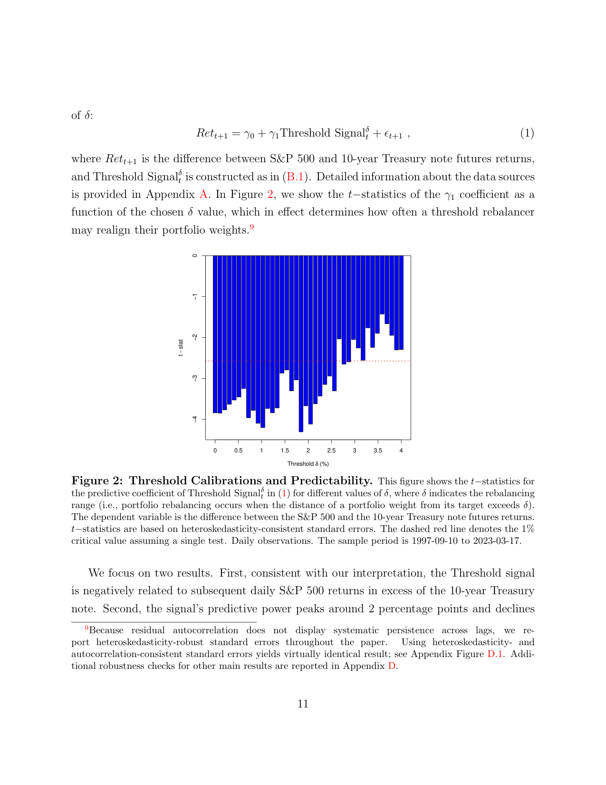

## Page 14

for values of δ above 2.5%. This evidence aligns with our first hypothesis, which is supported
by institutional practices of large funds, and is intuitive when viewed through the lens of
rebalancing frequency.
When δ = 0, the 60/40 portfolio rebalances 252 times per year
(i.e., every business day).
When δ = 1.1%, rebalancing occurs about once per month,
and at δ = 2.5% it happens about once per quarter. Given the need to manage cash flows,
rebalancing less frequently than once per quarter on average is unlikely for large institutional
investors.
Because Threshold is a function of past returns, one concern is that the predictability
documented in Figure 2 simply reflects serial correlation in returns. We address this concern
by exploiting the state-dependent nature of Threshold-based rebalancing, which implies in-
herently nonlinear predictability. Specifically, for each δ, we estimate predictive regressions
separately for days with |Threshold Signalδ
t| ≥δ, corresponding to predicted rebalancing
days, and for days with |Threshold Signalδ
t| < δ, corresponding to periods outside predicted
rebalancing days. Appendix Figure D.3 shows that predictability is systematically concen-
trated – up to δ ≈2.5% – in periods when funds are more likely to rebalance, consistent
with our interpretation.
In the remainder of this paper, we adopt a Threshold signal that is defined as the average
of Threshold signals computed using δ values that span the range 0%–2.5% with increments
of 0.1%.10 Formally,
Threshold Signalt = 1
N
2.5%
X
δ=0
Threshold Signalδ
t .
(2)
Averaging different rebalancing calibrations approximates what a heterogeneous group of
investors might implement while also reducing the set of potential predictors.11 Consistent
with these observations, introducing the Threshold signal in (2) yields a t-statistic for the
10Appendix Table D.6 shows that the results are similar when the Threshold signal is averaged over the
range 0%–2%, or excludes zero, averaging over the range 0.1%–2.5%. Also, one might be concerned that our
calibration exploits information from the full sample. To address this, we re-estimated the signal using only
the first half of the sample and found qualitatively similar results, with predictability becoming insignificant
for δ values above 2.5%.
11Chinco and Fos (2021) find that this heterogeneity can be a source of computational complexity. Our
results indicate robust and consistent predictability associated with the Threshold signal for economically
meaningful rebalancing ranges.
12

## Page 15

predictive coefficient exceeding 4 (in absolute terms), which is higher than the median t-
statistics across the range of δ values used to construct the aggregate signal.
Days to end−of−month
t −stat
−3.0
−2.5
−2.0
−1.5
−1.0
−0.5
0.0
−10
−9
−8
−7
−6
−5
−4
−3
−2
−1
Figure 3: Calendar Signals and End-of-Month Effect. This figure shows the t−statistics for
the predictive coefficient β2 in (3) for different values of DummyN Days
t
. DummyN Days
t
is a dummy variable
that takes the value of 1 during the last N−days of the month. The dependent variable is the difference
between S&P 500 and 10-year Treasury note futures returns. t−statistics are based on heteroskedasticity-
consistent standard errors. The dashed red line denotes the 1% critical value assuming a single test. Daily
observations. The sample period is 1997-09-10 to 2023-03-17.
A second important parameter in our study is the range of days when the Calendar
rebalancing effect is expected to materialize. To investigate this variable, we estimate the
following predictive models:
Rett+1 = β0+β1Calendar Signalt+β2Calendar Signalt·DummyN Days
t
+β3DummyN Days
t
+ϵt+1 ,
(3)
where DummyN Days
t
is a dummy variable that takes the value of 1 during the last N-days of a
month, and Calendar Signalt is constructed as in (B.2). Hence, (3) allows us to test whether
the predictive power of Calendar signal concentrate towards month-end, as we expect.
In line with the second hypothesis, we find that the Calendar signal is negatively related
to future S&P 500 returns in excess of the 10-year Treasury note, with this predictability
concentrated in the final days of the month. Figure 3 shows the t-statistics for the predictive
13

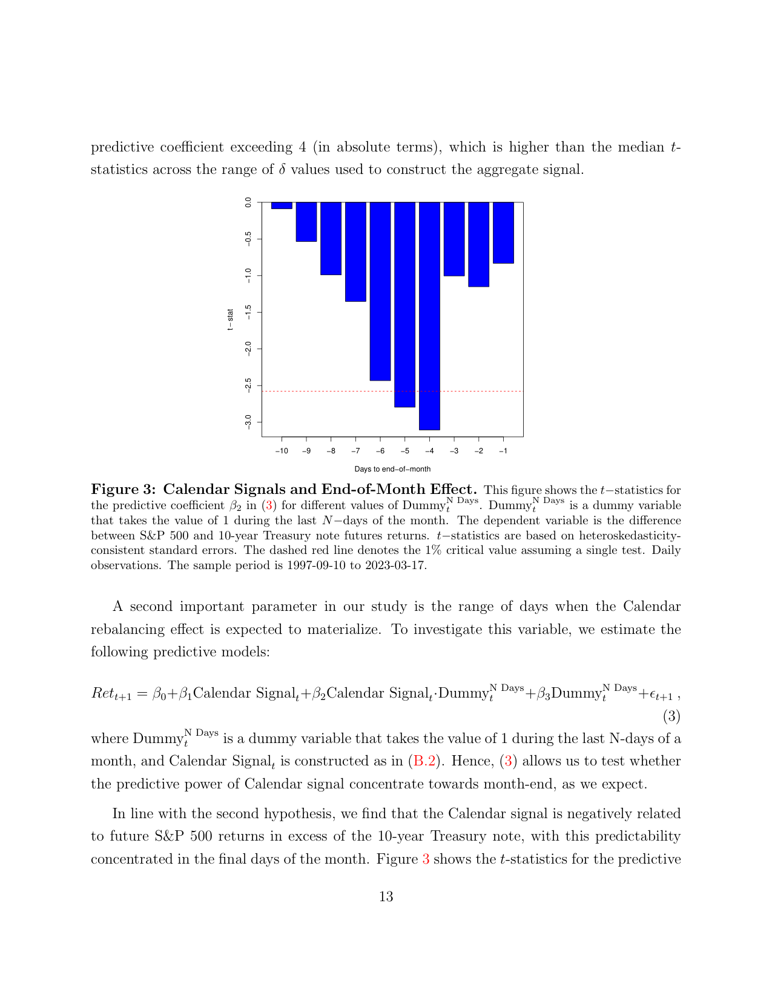

## Page 16

coefficient β2 in (3).
Calendar predictability peaks in the last four days of the month,
consistent with liquidity-driven trading by pension funds. Moreover, Figure 3 suggests that
funds attempt to minimize market impact by avoiding trades on the very last day while
spreading trades over several days. Therefore, our focus for the rest of the paper is the
interaction between the Calendar signal and the last week of the month, labeled as week4t,
which corresponds to Dummy5 Days
t
.12
1.3
Interpreting Rebalancing Signals
Appendix Figure C.1 plots the time-series of the Threshold and Calendar signals, while
Appendix Table C.1 shows summary statistics. Both series display high-frequency move-
ments around periods of market turmoil. The Calendar signal shows the greatest absolute
deviations, which are due to intra-month market volatility combined with an end-of-month
rebalancing approach. We find that the median rebalancing frequency of the Threshold sig-
nal is about 16 times per year, higher than the 12 times per year of the Calendar approach.
The average values of the Threshold and Calendar signals are positive, reflecting the fact
that S&P 500 returns in excess of the 10-year Treasury note average about 3% per year in
our sample. As a result, rebalancers tend to sell equities and buy bonds more often. The
two signals are positively correlated, with a correlation coefficient of approximately 60%.
By construction, the Threshold and Calendar signals are positively correlated with trail-
ing equity excess returns computed over different time frames. Since the Threshold signal
tends to rebalance more frequently than the Calendar signal, it should be more closely related
to short-term rather than long-term trailing excess returns.
In Appendix Table D.1, we report the estimated coefficients from regressing Threshold
and Calendar signals onto trailing excess returns of selected horizons.
The sums of the
coefficients for each regression are close to 0.24, which reflects our decision to simulate a
12This effect is distinct from the turn-of-the-month anomaly (e.g., Ariel, 1987; Lakonishok and Smidt,
1988), which refers to the observation that the U.S. stock index performs significantly better from the last
trading day of the month through either the first three (Lakonishok and Smidt, 1988) or nine (Ariel, 1987)
trading days of the following month. Ogden (1990) attributes this pattern to investors reinvesting cash
payments – including wages, dividends, interest, and principal payments – at the turn of each calendar
month.
14

## Page 17

60/40 portfolio’s dynamics.13 The Threshold signal displays its highest sensitivities to short
horizon trailing returns, as is consistent with its higher turnover statistics. The Calendar
signal displays a hump-shaped relationship that reflects how its horizon grows every month
until the last business day. Hence, the Threshold signal and Calendar signal resemble the
actions of a more frequent rebalancer and a less frequent rebalancer, respectively.
2
Rebalancing Pressures
This section documents market-wide pressures associated with rebalancing activity.
We
examine the price impact on stocks and bonds around rebalancing signals, analyze how
institutional investors adjust their trading in response, and draw on conversations with
pension fund leaders to provide further institutional context on the relevance of rebalancing
pressures.
2.1
Return-Based Evidence of Rebalancing
2.1.1
Rebalancing and Cross-Asset Return Predictability
Many factors can affect aggregate returns. For example, time-series momentum appears
as a ubiquitous driver of return dynamics (see, e.g., Moskowitz, Ooi, and Pedersen, 2012).
Furthermore, asset volatility is a well-known predictor of future returns, including at high-
frequency (e.g., Nagel, 2012), and sentiment is an important driver of returns, especially
at short-horizons (e.g., Da, Engelberg, and Gao, 2015). Thus, multivariate regressions are
the natural setting to study if and how rebalancing activity affects future returns. Finally,
we also want to understand whether Threshold and the Calendar signals contain different
informative predictive content, i.e., if they are jointly significant predictors of future cross-
asset returns.
13Since 60%×40% = 0.24, we can approximate the S&P 500 weight deviation from its target allocation as
≈0.24(RE −RB), where RE −RB measures the equity excess returns since the last rebalancing. Importantly,
from a predictive standpoint, our decision to simulate 60/40 portfolios rather than other allocations – such as
50/50 or 70/30 – does not affect our results qualitatively. From an economic perspective, an equal-allocation
portfolio implies the largest potential portfolio deviations and, therefore, the highest rebalancing pressures.
15

## Page 18

To this end, we run the cross-asset predictive multivariate regression:
Rett+1 = β0 + β′RebalancingSignalt + ψMomentumt + ζRett + γ′Xt + ϵt+1 ,
(4)
where, for the benchmark analysis, Ret is the difference between S&P 500 and 10-year Trea-
sury note futures returns. We naturally refer to this analysis as cross-asset (or, abbreviated,
XA) return predictability.
The RebalancingSignalt vector contains the Threshold and the Calendar signal con-
structed in Section 1.2; the Calendar signal is also interacted with a dummy variable taking
the value of 1 the last week (i.e., 5 days) of any month or 0 otherwise. Momentum and
rebalancing signals have a correlation higher than 67% (see Table C.2) but yield opposite
predictions, so controlling for momentum in our setting is important. As trailing returns
over different horizons convey distinct information (see, e.g., Goulding, Harvey, and Maz-
zoleni, 2023), we calculate fast, medium, and slow momentum signals. Since we find that
the fast momentum signal lacks predictive power in our specification, we construct our mo-
mentum signal, Momentumt, by averaging the medium and slow momentum signals.14 We
also control for trailing one-day returns, Rett.
The vector Xt contains three categories of control variables motivated by prior research.
First, as proxies for aggregate volatility, we use the Chicago Board Options Exchange
(CBOE) daily market volatility index (VIX), which measures the implied volatility of S&P
500 index options, together with the ICE BofA MOVE index, which tracks fixed income
market option volatility. The inclusion of the MOVE index is motivated by the fact that we
study both stock and bond return dynamics. Second, as controls for macroeconomic condi-
tions, we use the news-based measure of economic policy uncertainty developed by Baker,
Bloom, and Davis (2016) and the real-time business conditions index constructed in Aruoba,
Diebold, and Scotti (2009). Finally, as sentiment proxy, we include the daily news-based sen-
timent index constructed in Shapiro, Sudhof, and Wilson (2022). In Appendix Table C.2,
we report the correlation among all the predictors in our benchmark specification.
14Momentum fast is calculated as the average of the signs of trailing 1 to 10 daily excess returns; momentum
medium averages the signs of 11 to 20 daily excess returns; momentum slow averages the signs of 21, 42, 63,
126, and 252 daily excess returns. In Appendix Table D.3, we report robustness results using these three
distinct momentum signals.
16

## Page 19

Table 1: Cross-Asset Predictive Regressions

This table reports estimates for the multivariate predictive regression (4). $Ret$ is the difference between S&P 500 and 10-y Treasury note futures returns. Threshold and Calendar signals are constructed as described in Section 1.2. Momentum is computed by averaging the sign of 11 to 20, and 21, 42, 63, 126, and 252 trailing equity returns in excess of the 10-year Treasury note. VIX is the CBOE equity option-implied volatility index (divided by 100); MOVE is the U.S. bond market option-implied volatility index (divided by 100); EPU is the news-based measure of economic policy uncertainty from Baker, Bloom, and Davis (2016); ADS is the Aruoba, Diebold, and Scotti (2009) real-time business conditions index; Sentiment is the daily news-based sentiment index constructed in Shapiro, Sudhof, and Wilson (2022). Values in parentheses are heteroskedasticity-consistent standard errors. Constant estimates are not tabulated. Daily observations. The sample period is 1997-09-10 to 2023-03-17.

| | (1) | (2) | (3) | (4) | (5) |
| :--- | :---: | :---: | :---: | :---: | :---: |
| Threshold | $-0.4144^{***}$ | $-0.4208^{***}$ | $-0.4254^{***}$ | $-0.4254^{***}$ | $-0.4226^{***}$ |
| | $(0.1148)$ | $(0.1164)$ | $(0.1098)$ | $(0.1133)$ | $(0.1139)$ |
| Calendar | $0.0553$ | $0.0689$ | $0.0572$ | $0.0542$ | $0.0666$ |
| | $(0.0709)$ | $(0.0686)$ | $(0.0696)$ | $(0.0713)$ | $(0.0686)$ |
| week4 | $0.0002$ | $0.0002$ | $0.0002$ | $0.0002$ | $0.0002$ |
| | $(0.0004)$ | $(0.0004)$ | $(0.0004)$ | $(0.0004)$ | $(0.0004)$ |
| Calendar *week4 | $-0.3029^{***}$ | $-0.3036^{***}$ | $-0.3026^{***}$ | $-0.3032^{***}$ | $-0.3033^{***}$ |
| | $(0.0808)$ | $(0.0808)$ | $(0.0805)$ | $(0.0806)$ | $(0.0808)$ |
| Momentum | $0.0023^{***}$ | $0.0024^{***}$ | $0.0024^{***}$ | $0.0025^{***}$ | $0.0024^{***}$ |
| | $(0.0006)$ | $(0.0007)$ | $(0.0006)$ | $(0.0006)$ | $(0.0007)$ |
| Ret | $-0.0203$ | $-0.0167$ | $-0.0198$ | $-0.0192$ | $-0.0173$ |
| | $(0.0289)$ | $(0.0289)$ | $(0.0281)$ | $(0.0287)$ | $(0.0286)$ |
| VIX |  | $0.0090^*$ |  |  | $0.0076$ |
| |  | $(0.0053)$ |  |  | $(0.0062)$ |
| MOVE |  | $-0.0020^*$ |  |  | $-0.0019^*$ |
| |  | $(0.0011)$ |  |  | $(0.0011)$ |
| EPU |  |  | $0.0005^{*}$ |  | $0.0002$ |
| |  |  | $(0.0003)$ |  | $(0.0004)$ |
| ADS |  |  | $0.0000$ |  | $0.0001$ |
| |  |  | $(0.0002)$ |  | $(0.0002)$ |
| Sentiment |  |  |  | $-0.0016$ | $-0.0003$ |
| |  |  |  | $(0.0012)$ | $(0.0013)$ |
| Observations | $6,226$ | $6,226$ | $6,226$ | $6,226$ | $6,226$ |
| Adjusted R² | $0.0239$ | $0.0252$ | $0.0243$ | $0.0242$ | $0.0248$ |

## Page 20

Table 1 reports results for different specifications of the multivariate predictive regres-
sion (4). In Column (1), both Threshold and Calendar signals significantly predict future
daily XA returns, with associated t-statistics around 4. The negative signs for both sig-
nals are consistent with their role as rebalancing indicators: when stocks outperform bonds,
stocks become overweight in portfolios and need to be sold. Thus, rebalancers act as macro-
contrarians, as the TDF evidence in Parker, Schoar, and Sun (2023) suggests.15 This, in
turn, exerts downward pressure on XA returns. By contrast, momentum positively predicts
daily returns, consistent with the literature.
Columns (2) to (4) report results for regression (4) including as controls proxies for
volatility, macro conditions, and sentiment, respectively. This analysis shows that, while
some regressors (e.g., volatility and economic uncertainty) partially explain future return
dynamics, the two rebalancing signals remain strong predictors alongside momentum. Fi-
nally, we also include all regressors jointly. Column (5) reports this result showing that
Threshold and Calendar are highly significant determinants of future XA returns.16
The predictability of the rebalancing signals is both statistically and economically sig-
nificant: a one-standard-deviation decrease in the Threshold (Calendar) signal is associated
with an increase in XA returns of about 20 bps (19.2 bps) over the next trading day, and
vice versa. This is remarkable when compared to other daily return predictability results.
For example, Da, Engelberg, and Gao (2015) find that a one-standard-deviation increase in
their investor sentiment measure, FEARS, predicts an increase of 7.1 bps in the S&P 500.
Or, more recently, Hartzmark and Solomon (2025) document a 3.2 bps increase in aggregate
market returns for a one-standard-deviation increase in dividend payout. Furthermore, pos-
itive rebalancing signal values significantly predict future negative returns, while negative
values significantly predict future positive returns, i.e., predictability is not concentrated in
15Using individual portfolio data from Sweden, Calvet, Campbell, and Sodini (2009) find that households
are, on average, macro-contrarians. More recently, Gabaix, Koijen, Mainardi, Oh, and Yogo (2023) find
that U.S. households, by contrast, are on average pro-cyclical investors, with the important exception of
ultra-high-net-worth individuals.
16Appendix Table D.4 uses the return differential between the S&P 500 Index and the Bloomberg Aggregate
Bond Index, showing qualitatively and quantitatively similar results that indicate our findings are not specific
to the financial instrument used to analyze rebalancing pressures. Appendix Table D.5 shows that using
changes in the control variables (∆Xt = Xt −Xt−1) leads to similar results. Appendix Table D.6 shows that
constructing the Threshold signal as the average of Threshold measures computed over δ values spanning
0% to 2% (Columns (1) and (2)) or over δ values spanning 0.1% (i.e., excluding every-day rebalancing) to
2.5% (Columns (3) and (4)) leads to comparable results.
18

## Page 21

bad times. Finally, we find that the predictability associated with Threshold is stronger
when the signal magnitude is larger, aligning with its economic interpretation.
These results indicate that investors may incur meaningful costs when rebalancing. To
quantify these costs, we adopt a two-step procedure. First, we estimate costs in percentage
terms by multiplying the estimated price impact by the average rebalancing trade. Specif-
ically, we measure price impact using the predictive regression in equation (4), estimated
over periods in which rebalancing trades are expected to occur – namely, the last week of
the month for Calendar rebalancing, or the subsample of days for which the rebalancing
signal exceeds a given threshold for Threshold rebalancing. We then multiply the estimated
price impact by the average absolute distance to target at the time of rebalancing and by
the number of rebalancing trades per year.17 For the Calendar strategy, the implied annual
costs are
\
Price Impact×Average Trade Size×Trades per Year = |−0.39|×1%×12 ≈5 bps.
Applying the same procedure to the Threshold strategy yields annualized costs ranging from
6 to 27 bps across δ values between 0 and 2.5%, with an average of 15 bps.18
To estimate rebalancing costs, we make assumptions about the timing of trades under
both rebalancing rules. For the Calendar strategy, focusing on the last week of the month is
natural, as institutional investors typically rebalance at month- or quarter-end. The timing
is inherently more nuanced for the Threshold strategy. However, discussions with market
participants indicate that discretion in practice is limited. In particular, when rebalancing is
delegated to overlay managers – as suggested by institutional evidence discussed above – ex-
ecution tends to follow standardized procedures with limited scope for opportunistic timing.
To be conservative, we also consider a scenario in which managers rebalance before the signal
fully breaches the threshold, when the average trade size is approximately 1%, similar to the
Calendar case. Under this assumption, implied costs are about 11 bps. Averaging between
the Calendar and Threshold estimates yields an annual rebalancing cost of approximately
8 bps, which we use in subsequent calculations.
Consider the economic context of our 8 bps estimate. First, institutional investors typ-
17An alternative specification estimates a single regression using the full sample and interacts the rebal-
ancing signal with an indicator equal to one during rebalancing periods, either in the last week of the month
or when the signal exceeds a threshold. Results are largely the same.
18Etula et al. (2020) document that pension funds must sell securities at least four business days before
month-end to meet benefit payments. Consistent with their findings, a Calendar rebalancer trading on day
T −4 would incur a cost of roughly 9 bps. Costs are also higher in the post-PPA period (i.e., after 2006).
19

## Page 22

ically pay about 3 bps per year to invest passively across equity and bond markets. This
implies that mechanical rebalancing is nearly three times as costly as accessing these markets
in the first place. Second, Chen, Noronha, and Singal (2006) quantify the losses incurred
by index fund investors due to cross-sectional price pressures around the effective dates of
index additions and deletions. They find that, on average, S&P 500 index investors lose
approximately 4 bps per year. In addition, as TDFs and balanced funds are expected to
grow (e.g., Parker, Schoar, and Sun, 2023; Parker and Sun, 2025), the costs associated with
mechanical rebalancing could rise substantially over time.19
As a further benchmark, we consider a hypothetical random rebalancing strategy that
rebalances once per month on a randomly chosen day, yielding the same expected frequency
of 12 rebalancing events per year as our Calendar approach.
We simulate the strategy
10,000 times and report average costs across simulations. Appendix Figure D.5 displays the
distribution of economic costs. The average cost is 0.6 bps (median of 0.5 bps), indicating
that this simple randomization is associated with economically negligible price effects.20
Thus, all else equal, investors may be able to meaningfully reduce rebalancing costs by
avoiding the specific days on which other institutions concentrate their trading activity.
Finally, to translate these costs in dollar terms, we multiply the percentage cost by the
estimated dollar size of rebalancers. According to the Federal Reserve’s Financial Accounts,
U.S. retirement assets – including public and private DB and DC plans and IRAs but exclud-
ing Social Security – totaled $37.8 trillion at year-end 2022. By our calculations, more than
$20 trillion of these assets may have been invested in public equity and debt.21 Thus, cur-
rent rebalancing policies cost approximately $16 billion per year. As a sense of scale, Chen,
Noronha, and Singal (2006) estimate that index reconstitutions generate annual losses of
$1.0–2.1 billion for investors in funds linked to the S&P 500 and Russell 2000. Using a
19According to the Investment Company Institute (ICI), total U.S. retirement assets reached $45.8 trillion
as of June 30, 2025 – an increase of more than 15% since 2023; see ICI.
20We deliberately allow random rebalancing dates to fall within the final week of the month, coinciding
with Calendar rebalancing. When we exclude the final week from the random selection, the resulting costs
are even smaller.
21According to a 2023 study by the Congressional Research Service (CRS), of the $14 trillion in public
DB and DC plans, approximately $7.2 trillion is allocated to public equity and fixed income. In private DC
plans, which total $8.1 trillion, about $6.8 trillion is invested in TDFs or directly in equities and fixed income.
Additionally, an estimated $2.3 trillion in private DB plans and $4.8 trillion in IRAs may be allocated to
public equity and debt. For the full report, see CRS Report.
20

## Page 23

different approach, Petajisto (2011) estimates annual index turnover costs of $2.5–3.4 billion
for S&P 500 index funds and $170–340 million for Russell 2000 index funds. These find-
ings led index providers to revise reconstitution and index design policies. This comparison
provides an additional benchmark for gauging the economic significance of our $16 billion
annual estimate. Furthermore, about two-thirds of U.S. households have a financial stake
in the U.S. retirement system, according to the Survey of Consumer Finances (SCF). Given
that there were about 127 million households in the U.S., as reported by the Census Bureau
in 2022, the annual cost of rebalancing per household reaches almost $200.
2.1.2
Price Pressures
Threshold and Calendar signals are proxies for rebalancing activity, largely reflecting insti-
tutional mandates and expected to convey limited information about market fundamentals.
Nevertheless, several models predict that even uninformed trades can influence prices (see,
e.g., Grossman and Miller, 1988; De Long, Shleifer, Summers, and Waldmann, 1990 for early
work, or more recently, Vayanos and Vila, 2021; Gabaix and Koijen, 2021).
We investigate the persistence of rebalancing price pressures by running the regression:
Rett+1:t+i = β0 + β′RebalancingSignalt + ψMomentumt + ζRett + ϵt+i ,
(5)
where Rett+1:t+i are cumulative log returns up to t + i. To address potential inference issues
related to overlapping observations, we follow Ang and Bekaert (2007) and use conserva-
tive standard errors from reverse regressions to compute confidence bands, as proposed by
Hodrick (1992). Furthermore, Appendix Figure 4 shows results for non-overlapping returns.
Figure 4 shows the estimated coefficients for Threshold in Panel (a) and Calendar in
Panel (b) from the multivariate predictive regression (5), along with their 95% confidence
intervals. Point estimates reach their trough in Day 4 and Day 2 for Threshold and Calendar,
respectively, before nearly reverting within 15 days.
The predictive coefficients become
statistically indistinguishable from zero at the 5% level by Day 9 for Threshold and Day 6
for Calendar.
Increasing the predictability horizon of (5), while introducing significant noise to our
21

## Page 24

estimates, reveals that point estimates for both rebalancing signals would completely revert
within less than two months. Thus, while our point estimates indicate that rebalancing
pressures are not quickly reversed in full, this evidence suggests that these pressures even-
tually dissipate. As discussed in Hartzmark and Solomon (2025), although reversals have
been extensively studied in the cross-section, understanding the speed and extent to which a
market-level pattern like ours should reverse remains an important avenue for future research.
−1.0
−0.5
Days Ahead
Predictive Coefficients
(a) Threshold
−1.0
−0.5
Days Ahead
Predictive Coefficients
(b) Calendar * week4
Figure 4: Rebalancing and Horizon of Cross-Asset Return Predictability. This
figure shows coefficient estimates and 95% confidence intervals for Threshold and Calendar signals for the
multivariate predictive regression (5). Confidence bands are computed using Hodrick (1992) standard errors.
Daily observations. The sample period is 1997-09-10 to 2023-03-17.
2.1.3
Robustness
Different Portfolio Weights.
Our decision to simulate 60/40 portfolios rather than other
calibrations simply influences the magnitude of the estimated predictive coefficients.
To
illustrate this point, Appendix Table D.7 replicates Column (1) of Table 1 using rebalancing
signals derived from simulated balanced portfolios with different equity–bond allocations.
The first column of Appendix Table D.7 reports results for an 86/14 equity–bond portfo-
lio. The resulting signals exhibit statistical significance comparable to the baseline specifica-
22

<!-- socr:chart-axis-residue
axis tick labels from the chart on this page; not data values.
0.0
0.5
1
2
3
4
5
6
7
8
9
10
11
12
13
14
15
0.0
0.5
1
2
3
4
5
6
7
8
9
10
11
12
13
14
15
socr:end-chart-axis-residue -->

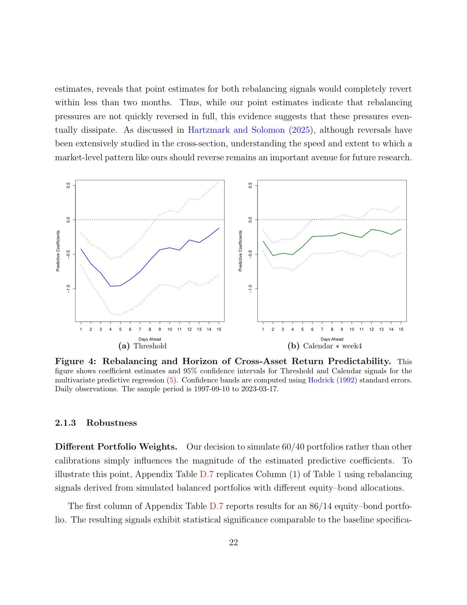

## Page 25

tion, but with coefficients that are approximately twice as large. This scaling is mechanical
and expected, as the magnitude of rebalancing signals constructed from an 86/14 portfolio is
roughly half that of signals based on the 60/40 calibration.22 The second and third columns
report results for 50/50 and 70/30 equity–bond portfolios, respectively. In both cases, al-
ternative calibrations rescale the magnitude of the predictive coefficients while leaving the
predictive power and statistical significance of the rebalancing signals largely unchanged.
The results are economically intuitive. When equity markets rise sharply, funds sell equities
regardless of the target allocation.
Threshold is Not Simply Capturing Return Autocorrelation.
One potential con-
cern is that the Threshold signal predicts returns simply because it captures return autocorre-
lation. This concern does not apply to the Calendar signal, which exploits a seasonal pattern
and is therefore not susceptible to this critique. To address this concern, we exploit the state-
dependent nature of the Threshold signal. We show that the predictability associated with
Threshold is not purely driven by return autocorrelation but instead exhibits economically
meaningful non-linearities linked to the rebalancing process. Specifically, Columns (1) and
(2) of Appendix Table D.8 decompose the Threshold signal into periods of large deviations
(above its median, Threshold Large) and small deviations (below its median, Threshold
Small). Column (1) reveals a pronounced non-linearity in Threshold effects: only Threshold
Large generates statistically significant predictability. This finding is consistent with the
notion that, during these periods, portfolio deviations are larger and rebalancing activity is
more likely, leading to price impact. Column (2) includes additional controls and shows that
the results are largely unchanged.
Finally, we construct an alternative Threshold signal, Threshold⊥, defined as the original
22For example, if equities earn a 10% excess return while bonds are flat, the deviation of the S&P 500
from a 60% target allocation is
0.60 × 0.40 × 10% = 0.24 × 10% = 2.4%.
In contrast, the deviation from an 86% target allocation is
0.86 × 0.14 × 10% ≈0.12 × 10% = 1.2%.
Thus, selecting a different target allocation – such as an 86/14 equity–bond mix – effectively rescales the δ
range used to construct the Threshold signal.
23

## Page 26

Threshold orthogonalized with respect to momentum and therefore exhibiting less serial
correlation. Columns (3) and (4) of Appendix Table D.8 demonstrate that our interpretation
continues to hold under this alternative specification.
Alternative Controls.
Appendix Table D.9 shows results when we consider alternative
control variables in our main predictive regression Table 1. Specifically, in Columns (1) to
(3) of Table D.9, we replace our main economic uncertainty and sentiment indexes with,
respectively, the uncertainty indexes constructed in Bekaert, Engstrom, and Xu (2022) and
the FEARS index constructed in Da, Engelberg, and Gao (2015) and show that it has little
effect on the results.23
Furthermore, we include the aggregate retail attention (ARA) index proposed by Da,
Hua, Hung, and Peng (2025) as a control, since attention-induced contrarian trading may
offer an alternative explanation for the market-wide pressures we document. Da et al. (2025)
show that ARA negatively predicts market returns, with stronger predictive power during
periods of high volatility and illiquidity – precisely when rebalancing-driven predictability
is also more pronounced. Moreover, ARA tends to spike at month-end, and when recent
excess returns are more salient, as captured by the Threshold signal. Column (4) of Table
D.9 reports the results, which remain largely unchanged after including ARA, suggesting
that our findings reflect a distinct dimension of return predictability.
The Role of Reversal.
A potential concern is whether alternative reversal signals could
subsume the predictive content of Threshold and Calendar. To study this question, we test
two reversal measures. First, inspired by Nagel (2012), we construct a short-term reversal
signal as the 5−day trailing XA returns. Second, following Fama and French (1996), we
calculate a long-term reversal signal as the 5−year trailing returns (i.e., 1260 days) skipping
the last year.
Table D.10 evaluates the predictive power of these two reversal measures. Column (1)
shows that short-term reversal significantly predict future daily XA returns and displays
the expected negative sign, although its effect is relatively small: a one-standard-deviation
increase in short-term reversal leads to an increase in XA returns of about 1.1 bps over
23We thank the authors for making their FEARS time series available to us.
24

## Page 27

the next trading day. This finding complements previous work focused on stock returns
alone (e.g., Nagel, 2012). In contrast, as shown in Column (3), long-term reversal does not
appear to predict XA returns at a daily frequency. In columns (2), (4), and (5), we expand
our main empirical specification by adding the two reversal measures. Including either or
both variables does not change our interpretation of the Threshold and Calendar signals.
Instead, the short-term reversal measure is not significant in the joint regression in Column
(2), suggesting that our rebalancing proxies capture its effect.24
2.2
Rebalancing and Institutional Investors’ Trades
We leverage four datasets to directly examine how our rebalancing signals relate to investors’
trades.
First, we use publicly available futures positions from the Commodity Futures Trading
Commission (CFTC). Futures positions provide insight into trading in key instruments used
for rebalancing and risk management. Our analysis investigates weekly position changes
for different types of traders.
The CFTC requires all large traders to identify as either
commercial or non-commercial. The former report using futures for hedging purposes. The
weekly Commitment of Traders (COT) reports detail the aggregate long and short positions
of futures market participants for these trader types. Following the previous literature (e.g.,
Bessembinder, 1992; De Roon, Nijman, and Veld, 2000; Moskowitz, Ooi, and Pedersen, 2012),
we refer to commercial traders as hedgers and to non-commercial traders as speculators. We
argue that hedgers primarily act as rebalancers: to mitigate tracking risk when portfolios
drift from their target allocations, they buy underweight assets and sell overweight assets.
We use CFTC data on S&P 500 and 10-year Treasury futures to construct a variable
capturing the trading behavior of hedgers and speculators, starting in August 2006. Fol-
lowing Kang, Rouwenhorst, and Tang (2020), we compute net trading Q as the cross-asset
net position change between t + 1 and t, scaled by open interest (i.e., the total number of
24Appendix Table D.11 investigates whether the end-of-month return patterns documented in Graziani
(2024) relate to our findings. We construct the end-of-month reversal signal (EoM Rev), defined as the return
between the fourth Friday’s close and the month-end close, and find that it has very low correlation with
our Calendar and Threshold signals (–0.062 and 0.038, respectively); in addition, EoM Rev is statistically
insignificant and does not affect the predictability of our rebalancing signals.
25

## Page 28

contracts outstanding) in week $t$. We calculate this measure separately for both hedgers and speculators and examine the relation between future net trading positions and current rebalancing signals.

The first part of Figure 5 shows that future hedger positions are negatively related to both Threshold and Calendar signals, whereas speculators display a positive relation. When equities are overweight (underweight) relative to bonds, hedgers sell (buy) equities and speculators take the opposite side, consistent with our interpretation.

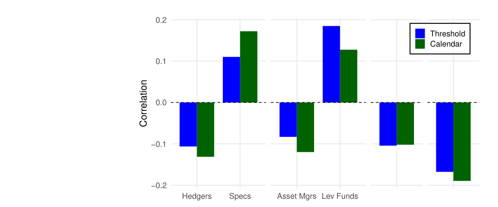

<!-- Image (220, 314, 770, 582) -->

**Figure 5: Rebalancing Signals and Trading Positions.** This figure shows the correlation between various institutional investors' trades and (lagged) rebalancing signals.

To further investigate which institutional investors trade in the direction of rebalancing pressures and which take the opposite side, we exploit the Large Trader Net Position Changes dataset. Published by the CFTC on June 30, 2011, this one-time report covers the period from January 2009 to May 2011 and provides the daily average aggregate net position changes for large traders across 35 futures markets. The report classifies financial futures traders into four groups: dealers/intermediaries, asset managers/institutional investors, leveraged funds, and other reportables. According to the CFTC, the dataset captures at least 80% of open interest in futures markets. ${ }^{25}$ We focus on asset managers - which include pension funds,

${ }^{25}$ Further details can be found on the CFTC website.

## Page 29

endowments, insurance companies, mutual funds, and portfolio/investment managers whose
clients are primarily institutional – and on leveraged funds, which typically comprise hedge
funds and other money managers such as commodity trading advisors.
The second group in Figure 5 reports the correlation between weekly net trading by these
two groups and lagged Threshold and Calendar signals. On average, asset managers sell eq-
uities and buy bonds when equities are overweight, whereas leveraged funds tend to take the
opposite side of these trades. Because the CFTC data are available only at weekly frequency,
they inevitably aggregate substantial within-week dynamics: hedge funds that temporarily
trade in the same direction as pensions for a few days and subsequently unwind their posi-
tions would appear as providing liquidity over the full week. Thus, the evidence should not
be interpreted as ruling out front-running or other short-horizon strategies. Rather, these
results offer a more granular counterpart to our first-panel findings and remain broadly con-
sistent with viewing the Threshold and Calendar signals as capturing rebalancing activity –
where some hedge funds act as liquidity providers to pensions, while others may be aligned
with them at higher frequencies that our data cannot detect.
Then, we use the ANcerno (formerly Abel Noser) dataset, which reports daily, trade-level
equity transactions for hundreds of institutional investors. As documented by Puckett and
Yan (2011), the sample includes institutions such as CalPERS and the YMCA Retirement
Fund and, in aggregate, accounts for about 8% of daily CRSP trading volume. For our
analysis, we focus on the period from January 1999 to September 2011, which corresponds
to the years in which pension plan sponsors can be identified, and we restrict attention to
trades in S&P 500 constituents to align with our empirical design. While limited, these data
provide a rare window into high-frequency pension fund trading; other (public) sources offer
only quarterly or annual aggregates (e.g., 13F filings and CRSP/Thomson Reuters holdings).
The third part of Figure 5 reports the correlation between the aggregate buy ratio – the
dollar value of the ANcerno institutional buy transactions divided by the sum of buy and
sell dollar values – and our lagged rebalancing signals. Consistent with our interpretation,
the pattern indicates that pension plans act as rebalancers. Moreover, the magnitude of this
correlation is comparable to that for CFTC hedgers in the first panel, further validating the
economic content of these data.
Finally, we also use estimated weekly net equity flows from the Long-Term Mutual Fund
27

## Page 30

Flows data provided by the Investment Company Institute (ICI), defined as U.S. total equity
flows minus bond flows. These data are available starting in January 2007. The fourth
grouping in Figure 5 shows that, on average, when equities are overweight relative to bonds,
mutual funds sell equities and buy bonds, consistent with our interpretation.
2.3
External Validity
We shared our preliminary empirical results with a group representing a global network of
public pensions. The director suggested that we host a roundtable with 16 different pensions
and present our preliminary findings. Held June 19, 2024, the meeting featured CIOs and
other senior executives representing approximately $2 trillion in pension assets.
At first, the discussion only touched on general rebalancing information. Are there tar-
get allocations? How frequently is rebalancing conducted? Is rebalancing performed on a
Calendar or Threshold basis? If on the former, how often do you rebalance? If on the latter,
what are the thresholds? Would derivatives be used for rebalancing? What market consider-
ations, if any, might delay or accelerate rebalancing? Based on the information we gathered,
all pensions had systematic rebalancing procedures, with some variation across Calendar-
and Threshold-based approaches.
We then presented our evidence that rebalancing induces predictability. Many pensions
acknowledged that they were aware of this phenomenon. When we explained that potential
front-runners could exploit such predictability, one pension replied, “We know about that.”
Others agreed.26 When we suggested a more dynamic rebalancing policy might reduce the
potential for front-running, one pension remarked, “It is easier for us to task our alpha
desk with addressing this predictability than to try to convince our investment committee
to change our rebalancing policy.”
In summary, all pensions in our roundtable sample rebalance mechanically based on
Calendar and Threshold rules. They understand these policies induce predictability and
believe that traders will front-run their rebalancing.
At least some of the funds appear
26Interestingly, in a March 2024 episode of the podcast Flirting with Models, an executive at one of the
world’s largest hedge funds described a front-running rebalancing strategy as an example of a widely used
systematic portfolio approach. Listen to the episode here.
28

## Page 31

to front-run their own and their peers’ rebalancing. Finally, the funds perceive changing
rebalancing policies as very challenging given institutional constraints.
3
Further Validation of Rebalancing Signals
This section further investigates the economic interpretation of our rebalancing signals
through five analyses.
First, we document seasonal patterns in the predictability of the
Threshold and Calendar signals and find that (i) Calendar predictability is strong at month-
end but absent at other times, and (ii) both signals’ predictive power and economic sig-
nificance increase toward the quarter-end. These seasonal patterns align with month- or
quarter-end trades driven by liquidity needs or benchmark tracking considerations rather
than risk or behavioral factors. Second, we show that our signals independently predict
both equity and bond excess returns, suggesting trades occur in both markets, consistent
with our interpretation. Third, we find that the signals’ predictive power became significant
in the early 2000s, coinciding with shifts in pension fund allocations, cash flow needs, and
2006 legislation affecting the Target Date Fund industry. Fourth, we demonstrate that our
rebalancing predictions extend to large- and small-cap stocks but do not extend to value and
growth stocks, consistent with the fact that many funds have target allocations to small and
large capitalization stocks but few have targets to growth and value. Lastly, we show that
the Threshold and Calendar signals extend to international equity returns.
3.1
Seasonal Patterns
In Panel A of Table 2, Column (2) indicates that the predictability of the Calendar signal
concentrates at month-end, while outside of these days, Calendar does not exhibit predictive
power (Column (1)).27 In Column (3), we demonstrate that this finding does not apply to
the Threshold signal. This distinction validates their interpretation: despite a correlation
higher than 60% (see Appendix Table C.2), these results show that the signals capture two
27Appendix Table D.12 further decomposes the Calendar effect across the four weeks of the month. While
month-end predictability is strongest, we also find statistically significant predictability in weeks 1 and 3. In
these weeks, however, the predictive coefficient is positive, consistent with a reversal of rebalancing pressures,
in line with our interpretation.
29

## Page 32

[page 32 failed: unverifiable table — see image]

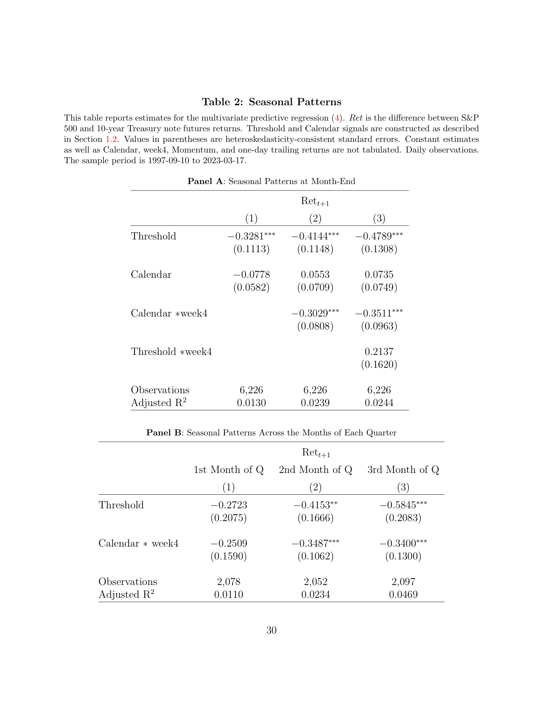

## Page 33

distinct rebalancing pressures.
Panel B of Table 2 shows that the predictability of our rebalancing signals varies across
the months within a quarter. Specifically, we divide the sample into three groups: the first
months of each quarter (January, April, July, and October), the second months of each
quarter (February, May, August, and November), and the third months of each quarter
(March, June, September, and December). Estimating our baseline regression conditional
on these samples reveals that the predictive power and economic significance of rebalancing
signals increase toward end-of-quarter.
The seasonal patterns in both the Threshold and Calendar signals align with the broader
tendency of capital markets to rebalance at least quarterly. For instance, performance reports
are often prepared quarterly, motivating portfolio managers to rebalance their allocations
according to this schedule. While portfolio managers may not strictly adhere to a single
rebalancing strategy – for instance, they might employ a mix of Threshold and Calendar
indicators – there is a collective tendency to adjust portfolios at least once per quarter. The
conditional estimates of the rebalancing signals’ coefficients reflect this behavior.
3.2
Dissecting Cross-Asset Predictability
If Threshold and Calendar are valid proxies for rebalancing activity, they should also predict
aggregate stocks and bonds individually. Specifically, Threshold and Calendar should nega-
tively predict equity excess returns and positively predict bond excess returns. To test this,
we run our benchmark regression (4) when Rett+1 is either S&P 500 or 10-year Treasury
note futures returns.
Table 3 reports the results.28 Columns (1) and (2) show results for equity, and Columns
(3)-(4) for bonds. As expected, when stocks are overweight, future stock returns are lower,
while future bond returns are higher, and vice versa. This effect is statistically significant
for both rebalancing proxies, even after including controls. Economically, a one-standard-
deviation decrease in the Threshold (Calendar) signal corresponds to an increase in equity
returns of about 15.9 bps (16.9 bps) and a decrease in bond returns of about 4.1 bps (2.3
28In untabulated analysis provided to us by a major asset manager, using the 3:30 PM price to compute
stock and bond returns instead of the closing price leads to largely the same results.
31

## Page 34

Table 3: Dissecting Cross-Asset Return Predictability

This table reports estimates for the multivariate predictive regression (4). $Ret$ is the S\&P 500 futures excess returns (first two columns) or 10-y Treasury note futures excess returns (last two columns). Values in parentheses are heteroskedasticity-consistent standard errors. Constant estimates are not tabulated. Appendix Table D.13 reports the coefficient estimates for all regressors. Daily observations. The sample period is 1997-09-10 to 2023-03-17.

| | Ret$_{t+1}^{\text{S\&P 500}}$ (1) | Ret$_{t+1}^{\text{S\&P 500}}$ (2) | Ret$_{t+1}^{10-\text{y}}$ (3) | Ret$_{t+1}^{10-\text{y}}$ (4) |
| :--- | :--- | :--- | :--- | :--- |
| Threshold | $-0.3302^{***}$ | $-0.3261^{***}$ | $0.0842^{***}$ | $0.0841^{***}$ |
| | $(0.1062)$ | $(0.1049)$ | $(0.0269)$ | $(0.0270)$ |
| Calendar | $0.0424$ | $0.0441$ | $-0.0129$ | $-0.0148$ |
| | $(0.0665)$ | $(0.0645)$ | $(0.0116)$ | $(0.0113)$ |
| week4 | $0.0005$ | $0.0005$ | $0.0004^{***}$ | $0.0004^{***}$ |
| | $(0.0004)$ | $(0.0004)$ | $(0.0001)$ | $(0.0001)$ |
| Calendar * week4 | $-0.2667^{***}$ | $-0.2671^{***}$ | $0.0362^{***}$ | $0.0372^{***}$ |
| | $(0.0758)$ | $(0.0762)$ | $(0.0128)$ | $(0.0127)$ |
| Momentum | $0.0018^{***}$ | $0.0018^{***}$ | $-0.0005^{***}$ | $-0.0005^{***}$ |
| | $(0.0005)$ | $(0.0006)$ | $(0.0001)$ | $(0.0001)$ |
| Ret | $-0.0223$ | $0.0030$ | $-0.0020$ | $-0.0027$ |
| | $(0.0264)$ | $(0.0430)$ | $(0.0065)$ | $(0.0093)$ |
| Controls | NO | YES | NO | YES |
| Observations | 6,223 | 6,223 | 6,223 | 6,223 |
| Adjusted R$^2$ | 0.0225 | 0.0242 | 0.0078 | 0.0072 |

## Page 35

bps) over the next trading day.29
3.3
Long-Term Evidence
There are several reasons to believe that Threshold and Calendar signals were less relevant
prior to the 2000s. First, portfolios are more diversified today than they used to be in the
past, and higher diversification should imply more rebalancing.30 Second, liquidity needs
have also changed, which requires pension funds to regularly sell assets to pay member
benefits at the beginning of each month.31 Finally, the TDF industry’s growth may have
also contributed to rebalancing’s rising importance. The 2006 Pension Protection Act (PPA)
designated TDFs and balanced funds as default options in DC plans, which helped propel
their growth and attract new savers to such contrarian strategies. Since TDFs inherently
engage in rebalancing, as demonstrated by Parker, Schoar, and Sun (2023), we would expect
stronger rebalancing pressures in recent years.
To test our hypothesis, in Table 4, we employ a longer dataset starting in the mid-1960s.
We use daily U.S. equity market total returns from Kenneth French’s database and estimate
daily 10-year Treasury note total returns using Federal Reserve Board Treasury data. In the
first column, we present whole-sample evidence. In the second and third columns, we split
the sample at September 10, 1997, which coincides with the start date of our evidence in
Table 1. The number of observations differs between Table 4 and 1 (6,421 vs. 6,226) due to
variations in trading days between CRSP and Bloomberg futures data.
The evidence reported aligns with our expectations.
While Column (1) shows that
Threshold and Calendar signals are significant predictors of future XA returns, splitting
29Pitk¨aj¨arvi, Suominen, and Vaittinen (2020) explore cross-asset predictability, demonstrating that past
bond returns predict future equity market returns, and past equity market returns predict future bond
market returns. Our findings complement their results by revealing that the same (rebalancing) signals
convey predictive power for both equities and bonds.
30Until the early 1990s, pension funds were mostly invested in fixed-income securities due to stricter
regulations, better funding conditions, and a higher interest rate environment. As interest rates declined,
pension plans began shifting large portions of their portfolios away from bonds and toward equities. For
example, the 2014 report “State Public Pension Investments Shift Over Past 30 Years” by the Pew Charitable
Trusts shows that, until the 1980s, over 80% of public pension fund assets were invested in cash and bonds;
see report.
31Due to changing demographics, most U.S. DB pension funds began experiencing negative cash flows by
the early 2000s (see, e.g., OECD reports Pension Markets in Focus).
33

## Page 36

Table 4: Long-Term Evidence

This table reports estimates for the multivariate predictive regression (4) by using a longer dataset. $Ret$ is the difference between daily U.S. equity total returns from Kenneth French's database and daily 10-year Treasury note total returns calculated using U.S. Treasury yield curve data from Gürkaynak, Sack, and Wright (2007). Threshold and Calendar signals are constructed as described in Section 1.2. Momentum is computed by averaging the sign of 11 to 20, and 21, 42, 63, 126, and 252 trailing equity returns in excess of the 10-year Treasury note. The data spans from 1961-06-16 to 2023-03-17 (the entire sample is used in the first column of the table). For consistency with our previous estimations, the estimations in the second column end on 1997-09-09, while those in the third column begin on 1997-09-10. Values in parentheses are heteroskedasticity-consistent standard errors. Constant estimates are not tabulated. Daily observations.

| | (1) | (2) | (3) |
| :--- | :--- | :--- | :--- |
| Sample | 1961-2023 | 1961-1997 | 1997-2023 |
| Threshold | $-0.1809^{***}$ | $-0.0157$ | $-0.3685^{***}$ |
| | $(0.0620)$ | $(0.0576)$ | $(0.1103)$ |
| Calendar | $0.0259$ | $-0.0204$ | $0.0573$ |
| | $(0.0411)$ | $(0.0495)$ | $(0.0612)$ |
| week4 | $0.0004$ | $0.0005^{**}$ | $0.0000$ |
| | $0.0002$ | $(0.0002)$ | $(0.0004)$ |
| Calendar * week4 | $-0.1536^{***}$ | $-0.0284$ | $-0.2569^{***}$ |
| | $(0.0471)$ | $(0.0596)$ | $(0.0670)$ |
| Momentum | $0.0013^{***}$ | $0.0004$ | $0.0020^{***}$ |
| | $(0.0003)$ | $(0.0003)$ | $(0.0005)$ |
| Ret | $0.0216$ | $0.1433^{***}$ | $-0.0144$ |
| | $(0.0192)$ | $(0.0245)$ | $(0.0280)$ |
| Observations | 15,291 | 8,870 | 6,421 |
| Adjusted R² | 0.0053 | 0.0204 | 0.0170 |

## Page 37

the sample allows for a deeper understanding of aggregate dynamics. Over the past approximately 30 years, the rebalancing coefficients are both quantitatively large and statistically significant, whereas they are indistinguishable from zero over the preceding four decades. These findings support the view that Threshold and Calendar signals effectively capture the behavior of large groups of rebalancers. Finally, we note that the estimates for the period 1997-2023 closely resemble those presented in Table 1, providing an additional robustness check for our main results.$^{32}$

## 3.4 Rebalancing Pressures across Equity Indices

Some TDFs have specific allocations to large- and small-capitalization stocks, suggesting that the impact of rebalancing pressures may extend beyond aggregate markets. For example, PGIM Target Date and BlackRock LifePath funds allocate capital explicitly between large-cap and small-cap stocks. Recent work by Pavlova and Sikorskaya (2023) further motivates our analysis, showing that investor demand is highly sensitive to changes in the composition of the Russell 1000 and Russell 2000 indices. Although such allocations apply only to a subset of institutional investors, they enable us to test our empirical strategy across different equity indices.

To study this rebalancing mechanism, we apply the empirical framework outlined in Section 1, with a few modifications. To emulate TDF design, we analyze a portfolio invested in the Russell 1000 and Russell 2000 indices. To reflect typical allocations, the portfolio maintains a 90%/10% split between the Russell 1000 and Russell 2000 rather than the conventional 60/40 allocation for stock/bond portfolios. Our analysis begins in August 2006, when TDFs started to come into broad use.

We also conduct a falsification test by examining rebalancing pressures across growth and value stocks using the Russell 1000 Value and Russell 1000 Growth indices. Since institutional investors do not generally target allocations between these two market segments, we expect Threshold and Calendar signals to be insignificant predictors of excess returns between value and growth stocks.

The results reported in Panel A of Table 5 offer some insights. For large- and small-

$^{32}$We have extended the sample through 2025 and find that the results become even stronger.

## Page 38

cap stocks, the Threshold and Calendar signals exhibit predictive power consistent with our
rebalancing interpretation. However, their statistical and economic significance is smaller
than that reported in Table 4, aligning with our observation that only a subset of institutional
investors may target allocations within specific segments of the U.S. equity market. Finally,
as expected, the rebalancing signals show no predictive power for excess returns between
value and growth stocks.
Table 5: Rebalancing across Equity Indices
In Column (1), we predict the returns of the Russell 1000 Index (R1K) in excess of the Russell 2000 Index
(R2K). In Columns (2), we predict the returns of the Russell 1000 Value Index (R1K Value) in excess of
the Russell 1000 Growth Index (R1K Growth).
Threshold and Calendar signals are constructed within
their respective equity segments.
We use momentum and one-day trailing returns as controls.
Values
in parentheses are heteroskedasticity-consistent standard errors. Constant and control estimates are not
tabulated. Daily observations. The sample period is 2006-08-17 to 2023-03-17.
(1)
(2)
R1K / R2K
R1K Value / R1K Growth
Threshold
−0.2054∗∗∗
−0.0339
(0.0597)
(0.0478)
Calendar * week4
−0.1174∗
−0.0678
(0.0683)
(0.0654)
Observations
4,175
4,175
Adjusted R2
0.0094
0.0023
3.5
Spillover Effects in International Equity
We expect international equity prices to be similarly affected by rebalancing activities as
U.S. equities. Allocations in international equities can constitute half or more of the size
of allocations to domestic equities. Additionally, the returns of domestic and international
equities are positively correlated. This implies that when an investor needs to rebalance their
domestic equity positions, it is likely that they also need to rebalance their international
equity positions.
To extend our analysis to international equities, we modify our empirical specification
36

## Page 39

to account for different closing times across stock markets. As international markets close
before the U.S. stock market, one-day U.S. equity returns are highly and positively correlated
with the subsequent one-day returns of international equity indices. We control for the two-
day trailing returns of the S&P 500 in order to characterize cross-market serial correlations.
Since our rebalancing signals depend on trailing returns, we lag them by one day. While
introducing this lag might reduce predictive power, it helps disentangle the positive cross-
market correlation due to time differences from the rebalancing effects we aim to measure.
Table D.14 shows that both Threshold and Calendar signal coefficients are negative and
significant, with magnitudes similar to the ones reported in Table 1.
The R2 from the
predictive regression is approximately 2.5%, indicating that the total variation explained is
also similar. Overall, this evidence suggests that rebalancing signals based on the dynamics
of U.S. equity and bond markets are predictive of the returns of international equity markets.
4
Front-Running Rebalancers
We construct a simple, implementable real-time trading strategy by combining Threshold
and Calendar signals.
This strategy simulates the actions of an investor who, based on
rebalancing signals, enters the equity and bond markets as a front-runner. On average, this
investor buys equities and sells bonds after bonds have relatively outperformed and buys
bonds while selling equities after equities have outperformed.
The trading strategy takes a position in a S&P 500 futures contract and an opposite
position in a 10-year Treasury note futures contract as follows:
RStrategy
t+1
= (RS&P 500
t+1
−R10-y
t+1 ) · wStrategy
t
,
where the portfolio weight wStrategy
t
is defined as the average of modified versions of the
Threshold and Calendar signals defined in Appendix B (see Eqs. (B.1)–(B.2)). We modify
Threshold signal by rescaling to −Threshold Signalt
1.5%
so that the two rebalancing signals have the
same risk contribution to the strategy; in our sample, both signals exhibit an annualized
volatility of 11.6%.
The signal is multiplied by −1 because a positive Threshold value
indicates that the S&P 500 is overweight relative to the 10-year Treasury note.
37

## Page 40

[page 40 failed: unverifiable table — see image]

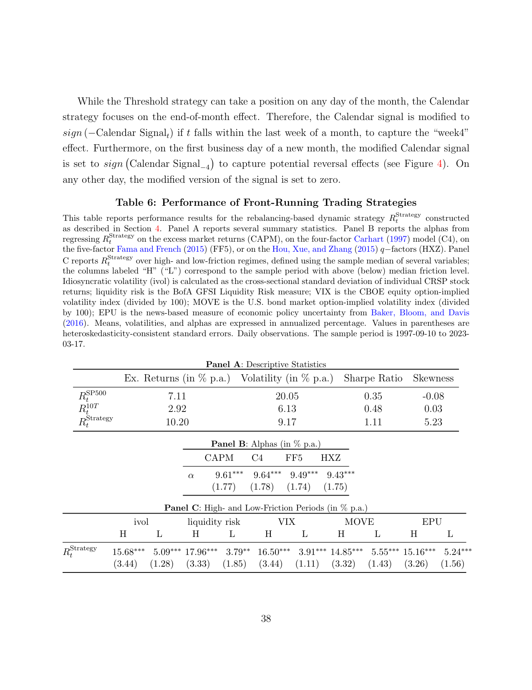

## Page 41

Panel A of Table 6 summarizes the trading strategy’s statistics. The rebalancing-based
strategy generates annualized average returns of approximately 10%, with a Sharpe ratio
above 1, much higher than the 0.35 and 0.48 of the equity and bond markets, respectively,
during our sample period. Importantly, our strategy is robust to the inclusion of transaction
costs. Following the conservative assumptions of Harvey et al. (2018), we estimate that the
Sharpe ratio net of transaction costs remains close to 1.
This performance cannot be explained by several standard factor models. In particular,
Panel B of Table 6 shows the alphas from regressing the RStrategy
t
on the market portfolio
(in excess of the risk-free asset), the Carhart (1997) four-factor model, the Fama and French
(2015) five-factor model, or the Hou, Xue, and Zhang (2015) q−factor model. The alphas are
positive, of significant magnitude, and highly significant, with a t−statistic above 4 for all
combinations of factor models. This evidence supports our interpretation that rebalancing
signals effectively times cross-asset returns rather than increasing exposure to systematic
risk factors.
The strategy exhibits a high positive skewness of 5.23. This suggests strong performance
during periods of heightened volatility, when the strategy takes larger positions, and market
liquidity is lower. It is consistent with the evidence in Figure 6, which plots the cumulative
log returns from investing $1 in the front-running strategy along with the performance of $1
invested in the RSP500
t
portfolio. In particular, the global financial crisis (GFC) of 2008–2009
and the 2020 COVID-19 crisis stand out as significant contributors to cumulative returns.
But the economic significance of our strategy does not rely solely on these two extreme
events: even after excluding the September 2008 to March 2009 and March 2020 periods,
the strategy’s Sharpe ratio remains elevated at 0.90.
Limits to arbitrage are critical for front-running strategies to be profitable. Indeed, as
valuations shift, rebalancers must adjust their positions to maintain target allocations, while
constrained liquidity providers cannot fully absorb the rebalancing pressures and instead
trade more slowly (see, e.g., Ben-David, Franzoni, and Moussawi, 2012; Gˆarleanu and Ped-
ersen, 2013; Vayanos and Vila, 2021). Front-runners anticipate these dynamics and exploit
the predictable price impact. However, we emphasize that front-running the rebalancing is
not a risk-free strategy. Trading ahead of rebalancers is risky due to uncertainty in both the
timing and magnitude of the rebalancing trades (e.g., Dou, Kogan, and Wu, 2023).
39

## Page 42

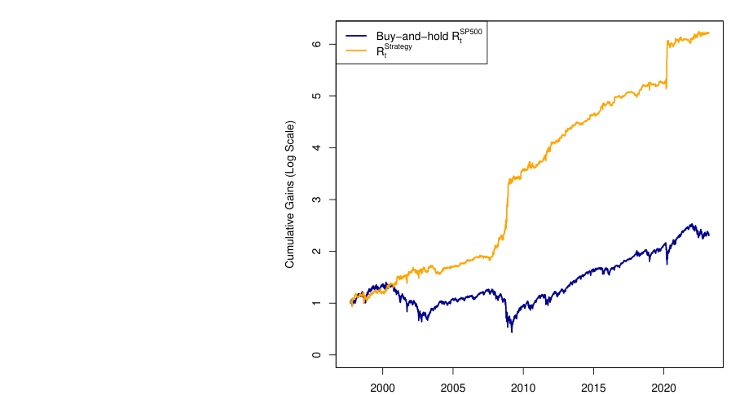

Figure 6: Front-Running Strategy Performance Over Time. This figure shows the cumulative gains of \$1 invested in the rebalancing-based strategy, $R_t^{\text{Strategy}}$, constructed as described in Section 4, alongside the performance of \$1 invested in the $R_t^{\text{SP500}}$ portfolio. $R_t$ denotes excess returns. $R_t^{\text{Strategy}}$ is rescaled to match the volatility of $R_t^{\text{SP500}}$. Daily observations. The sample period is 1997-09-10 to 2023-03-17.

We examine how periods with different levels of friction affect how our strategy performs. As discussed in, e.g., Gromb and Vayanos (2010), limits to arbitrage can arise from a variety of frictions. First, we consider idiosyncratic volatility (ivol), which is widely considered to be a major implementation cost of short arbitrage (Pontiff, 1996, 2006). We follow the model-free approach of Garcia, Mantilla-García, and Martellini (2014) to compute ivol at a daily frequency as the cross-sectional standard deviation of individual CRSP stock returns. ${}^{33}$ We also examine several aggregate risk and uncertainty measures. These include: the Bank of America Global Financial Stress Index (GFSI) Liquidity Risk, which measures funding stress in the global financial system through spread-based relationships in rates, credit, and currencies; VIX and MOVE, the option-implied volatility measures for the U.S. stock and

${}^{33}$ Garcia, Mantilla-García, and Martellini (2014) show that their measure is a consistent and asymptotically efficient estimator for aggregate idiosyncratic volatility. Furthermore, they find that the correlation between cross-sectional volatility and the model-based ivol as computed in Ang, Hodrick, Xing, and Zhang (2006) is above 99%.

## Page 43

bond market, respectively; and the news-based measure of economic policy uncertainty from
Baker, Bloom, and Davis (2016).
Panel C of Table 6 reports the (percentage) annualized performance of our strategy
during high (H) and low (L) friction periods, defined based on the sample median of the
limits of arbitrage proxy used. The analysis shows that front-running strategies perform
better during high friction periods – characterized by elevated volatility, low liquidity, and
heightened uncertainty – than low friction periods. This result is important as it suggests
that our strategy is more profitable when liquidity providers are more constrained and price
impact is larger, consistent with our interpretation.
5
Discussion
Implications?
Given the economic significance of rebalancing costs, institutional investors
should consider reassessing their rebalancing policies. First, the use of deterministic or sys-
tematic policies can lead to price impact. These pressures will likely intensify in the future
as TDFs and other balanced funds come into broader use. Much of the institutional industry
relies on Calendar or Threshold policies. This increases the likelihood that these investors
will trade in the same direction at the same time and induces a mechanical predictability in
returns that encourages front-running. Second, changing the design of benchmarks, such as
end-of-month rebalancing, could have a major effect on rebalancing strategies. Those port-
folio managers that tend to minimize tracking risk would immediately evolve their strategies
to adjust to new benchmarks. Third, institutional investors should be wary of hedge funds
and other investors that may anticipate their actions and attempt to profit from them. We
simulate trading strategies in liquid futures that have yielded consistent and relatively large
alpha over the last two decades; in addition, our own conversations with market participants
have confirmed that hedge funds do deploy front-running strategies. Fourth, because rebal-
ancing costs are borne by balanced funds, they remain hidden from individual investors who
tend to focus on a fund’s explicit fees. Yet these costs represent a clear drag on performance
– one that can be mitigated, as discussed next.
41

## Page 44

Can these rebalancing costs be reduced?
We are the first to document the market-
wide economic implications of rebalancing strategies for equity–bond portfolios – the core
allocation of institutional investors. This raises the question of whether more efficient re-
balancing approaches exist beyond the commonly used Threshold and Calendar strategies.
All else being equal, one could envision a cost-mitigating strategy that avoids pre-scheduled
rebalancing – for example, by introducing a random component to trade execution (e.g.,
Huddart, Hughes, and Levine, 2001).
To explore this idea, Section 2.1 analyzed a hypothetical random rebalancing strategy that
preserves the typical rebalancing frequency while eliminating predictable price pressures. We
find that this strategy generates negligible price effects, largely eliminating rebalancing costs.
These results indicate that a significant share of rebalancing costs arises from concentrated
trading on predictable dates.
Three considerations are worth emphasizing. First, while random rebalancing substan-
tially reduces transaction costs, it induces an average tracking error of approximately 35 bps.
For a standard 60/40 equity–bond portfolio with an annualized volatility of 12% in our sam-
ple, this corresponds to about 3% of total portfolio volatility. Although this magnitude may
appear small in absolute terms, its relevance varies across institutions. Investors operating
under tight benchmark-tracking mandates may find even modest deviations costly, whereas
others have greater flexibility. For example, Norges publicly reports a tracking error limit of
1.25% (see Norges).
Second, rebalancing decisions interact with the liability side of the balance sheet. Insti-
tutions with predictable end-of-month cash outflows may need to liquidate assets to meet
liabilities. If a random rebalance occurs early in the month, such investors forgo the return
on the rebalanced portfolio relative to cash over the remainder of the month, effectively
incurring an additional opportunity cost.
Third, rebalancing is ultimately a coordination exercise. The actions of individual re-
balancers can influence those of others, while liquidity providers and sophisticated investors
may further affect the effectiveness of any given strategy.34 Optimal rebalancing policies
are therefore likely to depend on investor size: smaller investors may rebalance more oppor-
34For example, Bessembinder, Carrion, Tuttle, and Venkataraman (2016) show that trader competition
can mitigate the price impact of predictable trades.
42

## Page 45

tunistically, whereas larger investors must consider the market impact of their own trades,
making aggregate liquidity conditions a central determinant of rebalancing costs.
In addition, investors may attempt to mitigate rebalancing costs through more active
portfolio management. For instance, Blume and Edelen (2004) show that index funds can
substantially enhance their performance by trading in advance of index additions and dele-
tions.35 In a similar spirit, balanced funds could potentially profit by anticipating trades
driven by rebalancing pressures.
This is also consistent with insights shared during the
pension fund roundtable discussion mentioned earlier.
What do investors gain from rebalancing?
Our paper documents the costs associ-
ated with large institutional investors mechanically rebalancing their portfolios. But are
there corresponding benefits? One striking observation, highlighted in our initial figure, is
the remarkable stability of asset allocations over time, clustered around a 60/40 equity–bond
mix. Stepping back, it is far from obvious that a continuously rebalanced 60/40 portfolio
is optimal for investors – or for pensioners. Determining the optimal portfolio choice lies
well beyond the scope of this paper. What is clear, however, is that in the absence of rebal-
ancing, portfolio weights mechanically drift toward equities – for example, a 60/40 portfolio
would evolve to roughly 80/20 over a decade – resulting in a less diversified allocation. One
may therefore argue that rebalancing preserves a degree of diversification consistent with in-
vestors’ risk preferences.36 At the same time, it is not clear that a fixed weight target portfolio
is itself optimal. Our analysis takes the target weights as given and shows that coordinated
rebalancing activity generates predictable market impact and economically significant costs.
35Khanjar (2025) studies bond indices and reaches similar conclusions.
36We simulate three portfolios using the same data and sample period (1997–2023) as in our main empirical
analysis: a buy-and-hold portfolio with an initial equity allocation of 60% that does not rebalance; a portfolio
that rebalances when the equity allocation breaches a 2.5% threshold; and a portfolio that rebalances at
month-end. We compute average utility as ¯U = ¯r −0.5γ¯σ2, where γ denotes risk aversion and ¯r and ¯σ2
denote the sample mean return and variance, respectively. For γ = 3, threshold rebalancing generates utility
gains of approximately 18 bps relative to buy-and-hold, while calendar rebalancing generates gains of about
10 bps.
43

## Page 46

6
Conclusion
We present the first evidence of aggregate price effects for U.S. stocks and bonds driven
by portfolio rebalancing activity.
Using daily U.S. data, we construct two return-based
proxies for institutional rebalancing behavior. When stocks outperform bonds, resulting in
an overweight allocation to stocks within a balanced portfolio, rebalancers sell stocks and
purchase bonds to restore target portfolio weights. On average, these rebalancing pressures
lead equity returns to fall by more than 16 bps and bond returns to increase by approximately
4 bps the following day. The opposite effect occurs when bonds outperform stocks. This
cross-asset return predictability cannot be explained by past returns, volatility measures,
macroeconomic conditions, or sentiment indicators. Moreover, rebalancing pressures largely
revert in less than two weeks, suggesting that rebalancing trades carry limited informational
content about asset fundamentals.
We show that institutional investors’ trading behavior is broadly consistent with our in-
terpretation. To further validate the economic content of our rebalancing signals, we conduct
several additional analyses. Specifically, we document (i) seasonal patterns consistent with a
rebalancing motive, (ii) return predictability in both equity and bond markets, (iii) a marked
increase in predictability over the past two decades, reflecting the growth of funds engaging
in rebalancing, (iv) predictability across equity indices, and (v) corroborating international
evidence.
Importantly, our results suggest that current rebalancing policies cost investors billions
of dollars every year. We estimate these costs to be approximately $16 billion per year, or
$200 per U.S. household. These costs are large compared to the cost of trading and it is
much large than the $1.5-2.5 billion cost documented in the literature for the rebalancing
of stocks within an index. As rebalancing pressures are expected to grow in the future with
the expansion of TDFs and other balanced funds, these costs could increase substantially.
Furthermore, mechanical rebalancing offers certain investors the opportunity to front-
run the predictable trades of large funds – a fact that, based on our conversations with
several large institutional investors, is well-known to both pension funds and hedge funds.
To explore the potential economic value of these front-running strategies, we construct a
managed portfolio that replicates the trades of a front-runner exploiting rebalancing signals.
44

## Page 47

This portfolio generates substantial positive alpha and achieves a Sharpe ratio greater than
1. Our analysis indicates that this strategy performs particularly well during periods of
heightened volatility, when sophisticated investors face greater constraints, consistent with
theories on the limits to arbitrage.
Overall, our findings highlight the importance of studying institutional investor trading
to better understand asset price dynamics. Institutional investors operate under specific
investment horizons, face unique constraints, and respond to distinct incentive structures,
all of which influence how and when they trade (Haddad and Muir, 2025). Recognizing these
features is essential for capturing the broader impact of their behavior on market outcomes.
We conclude by emphasizing that, while the objective of this paper is to quantify the
economic costs associated with mechanical rebalancing, rebalancing remains a fundamental
tool for ensuring portfolio diversification, managing liquidity, and generating utility gains for
mean-variance investors compared to a non-rebalanced portfolio. Importantly, our analysis
does not address whether commonly used portfolio rules – such as a 60/40 equity-bond
allocation – are optimal. Rather, we take prevailing rebalancing policies as given and study
their implications when implemented at scale. Finally, while investors are typically informed
about fund expenses, including transaction costs and management fees, our findings uncover
an additional cost that is not tabulated: the cost of rebalancing. Designing more effective
rebalancing policies that preserve the benefits of rebalancing while minimizing its costs seems
like a priority for future researchers and investors.
45

## Page 48

References
Ambachtsheer, K. P. 1987. Pension fund asset allocation: In defense of a 60/40 equity/debt
asset mix. Financial Analysts Journal 43:14–24.
Andonov, A., E. Eiling, and D. Xu. 2024. Target date funds and international capital flows.
Available at SSRN 4713750 .
Ang, A., and G. Bekaert. 2007. Stock return predictability: Is it there? Review of Financial
Studies 20:651–707.
Ang, A., R. J. Hodrick, Y. Xing, and X. Zhang. 2006. The cross-section of volatility and
expected returns. Journal of Finance 61:259–99.
Ariel, R. A. 1987.
A monthly effect in stock returns.
Journal of Financial Economics
18:161–74.
Aruoba, S. B., F. X. Diebold, and C. Scotti. 2009.
Real-time measurement of business
conditions. Journal of Business & Economic Statistics 27:417–27.
Baker, S. R., N. Bloom, and S. J. Davis. 2016. Measuring economic policy uncertainty.
Quarterly Journal of Economics 131:1593–636.
Bekaert, G., E. C. Engstrom, and N. R. Xu. 2022. The time variation in risk appetite and
uncertainty. Management Science 68:3975–4004.
Ben-David, I., F. Franzoni, and R. Moussawi. 2012. Hedge fund stock trading in the financial
crisis of 2007–2009. Review of Financial Studies 25:1–54.
Benham, F., R. Obregon, and M. Simanovich. 2018. Rebalancing. Meketa Investment Group,
White Paper.
Bessembinder, H. 1992. Systematic risk, hedging pressure, and risk premiums in futures
markets. Review of Financial Studies 5:637–67.
Bessembinder, H., A. Carrion, L. Tuttle, and K. Venkataraman. 2016. Liquidity, resiliency
and market quality around predictable trades: Theory and evidence. Journal of Financial
economics 121:142–66.
Blume, M. E., and R. M. Edelen. 2004. S & p 500 indexers, tracking errors, and liquidity.
Journal of Portfolio Management 30:37–46.
Bretscher, L., L. Schmid, I. Sen, and V. Sharma. 2025. Institutional corporate bond pricing.
The Review of Financial Studies hhaf067.
46

## Page 49

Buffa, A. M., D. Vayanos, and P. Woolley. 2022. Asset management contracts and equilibrium
prices. Journal of Political Economy 130:3146–201.
Calvet, L. E., J. Y. Campbell, and P. Sodini. 2009. Fight or flight? portfolio rebalancing by
individual investors. Quarterly Journal of Economics 124:301–48.
Camanho, N., H. Hau, and H. Rey. 2022. Global portfolio rebalancing and exchange rates.
Review of Financial Studies 35:5228–74.
Carhart, M. M. 1997.
On persistence in mutual fund performance.
Journal of Finance
52:57–82.
Chambers, D., E. Dimson, and A. Ilmanen. 2012. The Norway model. Journal of Portfolio
Management 38:67–81.
Chen, H. 2025. Diversification driven demand for large stocks. Journal of Financial Eco-
nomics 172:104109–.
Chen, H., G. Noronha, and V. Singal. 2006. Index changes and losses to index fund investors.
Financial Analysts Journal 62:31–47.
Chinco, A., and V. Fos. 2021. The sound of many funds rebalancing. Review of Asset Pricing
Studies 11:502–51.
Da, Z., J. Engelberg, and P. Gao. 2015. The sum of all fears investor sentiment and asset
prices. Review of Financial Studies 28:1–32.
Da, Z., J. Hua, T. C.-C. Hung, and L. Peng. 2025. Market returns and a tale of two types
of attention. Management Science 71:10505–37.
Da, Z., B. Larrain, C. Sialm, and J. Tessada. 2018. Destabilizing financial advice: Evidence
from pension fund reallocations. Review of Financial Studies 31:3720–55.
De Long, J. B., A. Shleifer, L. H. Summers, and R. J. Waldmann. 1990. Noise trader risk in
financial markets. Journal of Political Economy 98:703–38.
De Roon, F. A., T. E. Nijman, and C. Veld. 2000. Hedging pressure effects in futures markets.
Journal of Finance 55:1437–56.
Dou, W. W., L. Kogan, and W. Wu. 2023. Common fund flows: Flow hedging and factor
pricing. Journal of Finance (Forthcoming) .
Edelen, R. M., and J. B. Warner. 2001. Aggregate price effects of institutional trading: a
study of mutual fund flow and market returns. Journal of Financial Economics 59:195–
220.
47

## Page 50

Etula, E., K. Rinne, M. Suominen, and L. Vaittinen. 2020. Dash for cash: Monthly market
impact of institutional liquidity needs. Review of Financial Studies 33:75–111.
Fama, E. F., and K. R. French. 1996. Multifactor explanations of asset pricing anomalies.
Journal of Finance 51:55–84.
———. 2015. A five-factor asset pricing model. Journal of Financial Economics 116:1–22.
Gabaix, X., and R. S. Koijen. 2021. In search of the origins of financial fluctuations: The
inelastic markets hypothesis. Working Paper, National Bureau of Economic Research.
Gabaix, X., R. S. Koijen, F. Mainardi, S. Oh, and M. Yogo. 2023. Asset demand of U.S.
households. Available at SSRN 4251972 .
Garcia, R., D. Mantilla-Garc´ıa, and L. Martellini. 2014. A model-free measure of aggregate
idiosyncratic volatility and the prediction of market returns. Journal of Financial and
Quantitative Analysis 49:1133–65.
Gˆarleanu, N., and L. H. Pedersen. 2013. Dynamic trading with predictable returns and
transaction costs. Journal of Finance 68:2309–40.
Goulding, C. L., C. R. Harvey, and M. G. Mazzoleni. 2023. Momentum turning points.
Journal of Financial Economics 149:378–406.
Graziani, G. 2024. Time series reversal: An end-of-the-month perspective. Available at
SSRN 4349253 .
Gromb, D., and D. Vayanos. 2010. Limits of arbitrage. Annual Review of Financial Eco-
nomics 2:251–75.
Grossman, S. J., and M. H. Miller. 1988. Liquidity and market structure. Journal of Finance
43:617–33.
G¨urkaynak, R. S., B. Sack, and J. H. Wright. 2007. The U.S. treasury yield curve: 1961 to
the present. Journal of Monetary Economics 54:2291–304.
Haddad, V., P. Huebner, and E. Loualiche. 2025. How competitive is the stock market? the-
ory, evidence from portfolios, and implications for the rise of passive investing. American
Economic Review 115:975–1018.
Haddad, V., and T. Muir. 2025.
Market macrostructure: Institutions and asset prices.
Annual Review of Financial Economics 17.
Harris, L., and E. Gurel. 1986. Price and volume effects associated with changes in the s&p
500 list: New evidence for the existence of price pressures. Journal of Finance 41:815–29.
48

## Page 51

Hartzmark, S. M., and D. H. Solomon. 2025. Marketwide predictable price pressure. Amer-
ican Economic Review 115:3171–213.
Harvey, C. R., E. Hoyle, R. Korgaonkar, S. Rattray, M. Sargaison, and O. Van Hemert. 2018.
The impact of volatility targeting. Journal of Portfolio Management 45:14–33.
Hodrick, R. J. 1992. Dividend yields and expected stock returns: Alternative procedures for
inference and measurement. Review of Financial Studies 5:357–86.
Hou, K., C. Xue, and L. Zhang. 2015. Digesting anomalies: An investment approach. Review
of Financial Studies 28:650–705.
Huddart, S., J. S. Hughes, and C. B. Levine. 2001. Public disclosure and dissimulation of
insider trades. Econometrica 69:665–81.
Jansen, K. A. 2021. Long-term investors, demand shifts, and yields. Working paper.
Kang, W., K. G. Rouwenhorst, and K. Tang. 2020. A tale of two premiums: The role of
hedgers and speculators in commodity futures markets. Journal of Finance 75:377–417.
Khanjar, A. 2025. Index rebalancing strategies in fixed income. Bloomberg Research, White
Paper.
Koijen, R. S., and M. Yogo. 2019. A demand system approach to asset pricing. Journal of
Political Economy 127:1475–515.
Lakonishok, J., and S. Smidt. 1988. A ninety-year perspective. Review of Financial Studies
1:403–25.
Li, J. J., N. D. Pearson, and Q. Zhang. 2021. Impact of demand shocks on the stock market:
Evidence from chinese ipos. Working paper.
Lu, X., and L. Wu. 2025. Monetary transmission and portfolio rebalancing: a cross-sectional
approach. Available at SSRN 4413059 .
Moskowitz, T. J., Y. H. Ooi, and L. Pedersen. 2012. Time series momentum. Journal of
Financial Economics 104:228–50.
Nagel, S. 2012. Evaporating liquidity. Review of Financial Studies 25:2005–39.
Ogden, J. P. 1990. Turn-of-month evaluations of liquid profits and stock returns: A common
explanation for the monthly and january effects. Journal of Finance 45:1259–72.
Parker, J. A., A. Schoar, and Y. Sun. 2023. Retail financial innovation and stock market
dynamics: The case of target date funds. Journal of Finance 78:2673–723.
49

## Page 52

Parker, J. A., and Y. Sun. 2025. Target date funds as asset market stabilizers: evidence
from the pandemic. Journal of Pension Economics & Finance 24:183–208.
Pavlova, A., and T. Sikorskaya. 2023. Benchmarking intensity. Review of Financial Studies
36:859–903.
Peng, C., and C. Wang. 2023. Factor rebalancing. Available at SSRN 3327849 .
Perold, A. F., and W. F. Sharpe. 1988. Dynamic strategies for asset allocation. Financial
Analysts Journal 44:16–27.
Petajisto, A. 2011. The index premium and its hidden cost for index funds. Journal of
Empirical Finance 18:271–88.
Pitk¨aj¨arvi, A., M. Suominen, and L. Vaittinen. 2020. Cross-asset signals and time series
momentum. Journal of Financial Economics 136:63–85.
Pontiff, J. 1996. Costly arbitrage: Evidence from closed-end funds. Quarterly Journal of
Economics 111:1135–51.
———. 2006. Costly arbitrage and the myth of idiosyncratic risk. Journal of Accounting
and Economics 42:35–52.
Puckett, A., and X. Yan. 2011. The interim trading skills of institutional investors. Journal
of Finance 66:601–33.
Rattray, S., N. Granger, C. R. Harvey, and O. Van Hemert. 2020. Strategic rebalancing.
Journal of Portfolio Management 46:10–31.
Ritter, J. R., and N. Chopra. 1989. Portfolio rebalancing and the turn-of-the-year effect.
Journal of Finance 44:149–66.
Sammon, M., and J. J. Shim. 2026. Index rebalancing and stock market composition: Do
indexes time the market? Journal of Financial Economics 177:104229–.
Shapiro, A. H., M. Sudhof, and D. J. Wilson. 2022. Measuring news sentiment. Journal of
Econometrics 228:221–43.
Shleifer, A. 1986. Do demand curves for stocks slope down? Journal of Finance 41:579–90.
Vayanos, D., and J.-L. Vila. 2021. A preferred-habitat model of the term structure of interest
rates. Econometrica 89:77–112.
Warther, V. A. 1995. Aggregate mutual fund flows and security returns. Journal of Financial
Economics 39:209–35.
50

## Page 53

Zhang, Y., and H. Ahluwalia. 2024. A rational multi-asset portfolio rebalancing decision-
making framework. Journal of Portfolio Management 50.
Zhang, Y., H. Ahluwalia, A. Ying, M. Rabinovich, and A. Geysen. 2022. Rational rebal-
ancing: An analytical approach to multiasset portoflio rebalancing decisions and insights.
Vanguard Research, White Paper.
51

## Page 54

Internet Appendix
A
Data Sources
We construct continuous return series for the E-mini S&P 500 futures (ES) and the 10-
year U.S. Treasury note futures (TY) using Bloomberg’s nearby contracts. Specifically, ES1
refers to the front-month E-mini S&P 500 futures contract and ES2 to the second-nearest
contract; similarly, TY1 denotes the front-month 10-year Treasury note futures contract and
TY2 the second-nearest contract. These are reported by Bloomberg as excess return price
indices, which serve as the building blocks for our continuous series. To generate continuous
returns, we stitched together the first and second nearby contracts for each market while
accounting for the relevant expiry calendar. Our rule specifies that positions roll from the
front contract (ES1 or TY1) to the second contract (ES2 or TY2) at the end of the month
preceding the contract’s expiry month. From the first day of the expiry month until the
expiry date, returns are based on the second contract, while before this window and after
expiry they are based on the front contract. This methodology produces continuous time
series that avoid discontinuities at contract expiration and reflect an easily replicable rolling
convention. Lastly, a holiday was identified whenever both front contracts, TY1 and ES1,
were reported as N/A in Bloomberg, indicating that neither futures market had traded on
that date. In addition, we explicitly marked September 12–14, 2001, as exchange closures.
During this period ES1 displayed no prices, while ES2 appeared to carry stale values. Our
series and empirical analyses start September 10, 1997, when the first E-mini S&P 500 price
data is available.
From Bloomberg we also obtain daily index data for the S&P 500 Total Return Index,
the Bloomberg U.S. Aggregate Bond Total Return Index, and international equities (MSCI
ACWI ex USA Net Total Return Index (USD)), as well as implied volatility measures for
the equity market (VIX Index) and the Treasury bond market (MOVE Index).
B
Technical Details on the Construction of Rebalanc-
ing Signals
Consider a balanced equity–bond portfolio, where equity consists of S&P500 futures and
bond consists of 10-year U.S. Treasury note futures. This portfolio is rebalanced following
approach j, where j = T, C, indicating Threshold and Calendar, respectively. We denote by
wj
t the proportion of the portfolio invested in equity at time t and by (1−wj
t) the proportion
invested in bonds. Target weights follow a common 60/40 allocation. Thus, at time t = 0,
52

## Page 55

60% of the portfolio is invested in S&P500 and 40% in the 10-year U.S. Treasury note, i.e.,
wj
t = 60%.
At any time t, weights are updated as a function of past weights, equity returns, and
bond returns. Specifically, after one period we have:
wj
t+1(wj
t; RSP
t+1; R10Y
t+1 ) =
wj
t(1 + RSP
t+1)
wj
t(1 + RSP
t+1) + (1 −wj
t)(1 + R10Y
t+1 )
where RSP
t+1 and R10Y
t+1 indicate the returns earned by the S&P500 and the 10-year Treasury
note, respectively.
In the absence of rebalancing, no trading takes place and the following holds true:
wj
t+1 = wj
t+1(wj
t; RSP
t+1; R10Y
t+1 )
Weights are allowed to drift until a portfolio is rebalanced and portfolio weights are brought
back to their targets.
According to the Threshold approach, portfolio rebalancing takes place when portfolio
weights exceed their targets by more than δ:
wT
t+1 =
(
60%
if
wT
t −60%

<!-- socr-corrupt-equation: structurally-valid LaTeX candidate (syntax only, non-authoritative — crop is ground truth) -->
$$
|\varepsilon_0| \geq \delta,
$$
wT
t+1(wT
t ; RSP
t+1; R10Y
t+1 )
otherwise.
According to the Calendar approach, rebalancing simply takes place on the last business
day of every month:
wC
t+1 =
(
60%
if t is the last business day of the month,
wC
t+1(wC
t ; RSP
t+1; R10Y
t+1 )
otherwise.
Lastly, we can define the rebalancing signals as weight deviations from target. Specifically,
the Threshold signal is defined as:
Threshold signalδ
t+1 = wT
t+1(wT
t ; RSP
t+1; R10Y
t+1 ) −60%
(B.1)
where δ denotes the threshold adopted to rebalance the portfolio. The Calendar signal is
defined as:
Calendar signalt+1 = wC
t+1(wC
t ; RSP
t+1; R10Y
t+1 ) −60%
(B.2)
where the portfolio is rebalanced on a monthly cadence.
53

[corrupt equation unresolved: ok; see retained crop]
[corrupt equation source overlapped an earlier recovery; original bytes represented by that earlier recovery]

## Page 56

C
Summary Statistics
2000
2005
2010
2015
2020
−0.08
−0.06
−0.04
−0.02
0.00
0.02
(a) Threshold Signal
2000
2005
2010
2015
2020
−0.08
−0.06
−0.04
−0.02
0.00
0.02
(b) Calendar Signal
Figure C.1: Rebalancing Signals. This figure shows the two rebalancing measures constructed as
described in Section 1.2. Daily observations. The sample period is 1997-09-10 to 2023-03-17.
Table C.1: Rebalancing Signals: Summary Statistics
This table reports summary statistics for the two rebalancing measures constructed as described in Section
1.2. Mean and standard deviation (SD) are annualized. Daily observations. The sample period is 1997-09-10
to 2023-03-17.
Mean
SD
AR1
Skewness
Exc. Kurtosis
Threshold Signal
0.49
0.08
0.61
-0.98
2.69
Calendar Signal
0.18
0.16
0.91
-1.43
6.27
54

## Page 57

Table C.2: Correlation Matrix for Different Predictors

This table reports the correlation matrix for the signals used in our main predictive regressions. Threshold and Calendar signals are constructed as described in Section 1.2. Momentum is computed by averaging the sign of 11 to 20, and 21, 42, 63, 126, and 252 trailing equity returns in excess of the 10-year Treasury note. Controls include: VIX is the CBOE equity option-implied volatility index; MOVE is the U.S. bond market option-implied volatility index; EPU is the news-based measure of economic policy uncertainty from Baker, Bloom, and Davis (2016); ADS is the Arnob, Diebold, and Scotti (2009) real-time measure of economic policy uncertainty from Shaprio, Studhof, and Wilson (2022). Daily observations. The sample period is 1997-09-10 to 2023-03-17.

| Threshold | Calendar | Momentum | VIX | MOVE | Econ Uncertainty | Econ Activity | Sentiment |
|---|---|---|---|---|---|---|---|
| 1 | 0.605 | 0.676 | -0.353 | -0.252 | -0.062 | 0.058 | 0.101 |
| 1 | 0.676 | -0.408 | -0.239 | -0.129 | 0.156 | 0.130 | |
| 1 | -0.489 | -0.373 | -0.146 | 0.190 | 0.247 | | |
| 1 | 0.630 | 0.443 | -0.323 | -0.530 | | | |
| 1 | 0.117 | -0.187 | -0.333 | | | | |
| 1 | -0.278 | -0.560 | | | | | |
| 1 | 0.200 | | | | | | |
| 1 | | | | | | | |

## Page 58

D
Additional Results
Threshold δ (%)
t −stat
−4
−3
−2
−1
Figure D.1: Threshold Calibrations and Predictability. This figure replicates Figure 2
using heteroskedasticity-and-autocorrelation-consistent standard errors. The dashed red line denotes the 1%
critical value assuming a single test. Daily observations. The sample period is 1997-09-10 to 2023-03-17.
Days to end−of−month
t −stat
−3.5
−3.0
−2.5
−2.0
−1.5
−1.0
−0.5
0.0
−10
−9
−8
−7
−6
−5
−4
−3
−2
−1
Figure D.2: Calendar Signals and End-of-Month Effect. This figure replicates Figure 3
using heteroskedasticity-and-autocorrelation-consistent standard errors. The dashed red line denotes the 1%
critical value assuming a single test. Daily observations. The sample period is 1997-09-10 to 2023-03-17.
56

<!-- socr:chart-axis-residue
axis tick labels from the chart on this page; not data values.
0
0
0.5
1
1.5
2
2.5
3
3.5
4
socr:end-chart-axis-residue -->

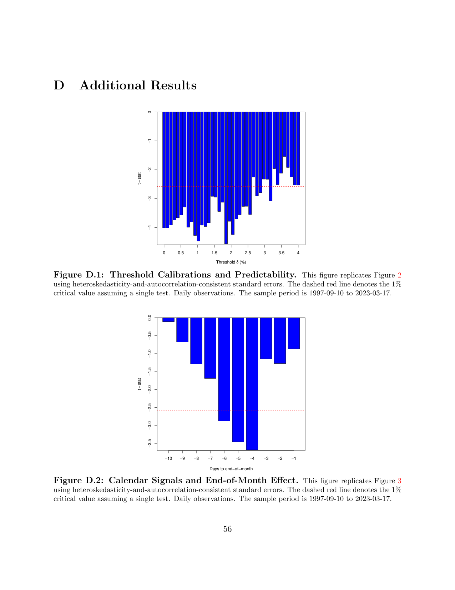

## Page 59

Figure D.3: Threshold Calibrations and Conditional Predictability. This figure shows the $t$-statistics for the predictive coefficient in (1) for different values of the threshold rebalancing range $\delta$. The dependent variable is the difference between the S&P 500 and the 10-year Treasury note futures returns. For each $\delta$, predictive regressions are estimated separately for days with $|\text{Threshold Signal}_t^\delta| \geq \delta$, corresponding to predicted rebalancing days, and for days with $|\text{Threshold Signal}_t^\delta| < \delta$, corresponding to days outside predicted rebalancing periods. $t$-statistics are based on heteroskedasticity-consistent standard errors. The dashed red line denotes the 1% critical value assuming a single test. Daily observations. The sample period is 1997-09-10 to 2023-03-17.

> **Unresolved chart placement on page 59** — the source position of chart region(s) 1 could not be located in the accepted text. The crop(s) below are preserved in source order; their position relative to the surrounding text and tables is NOT established.

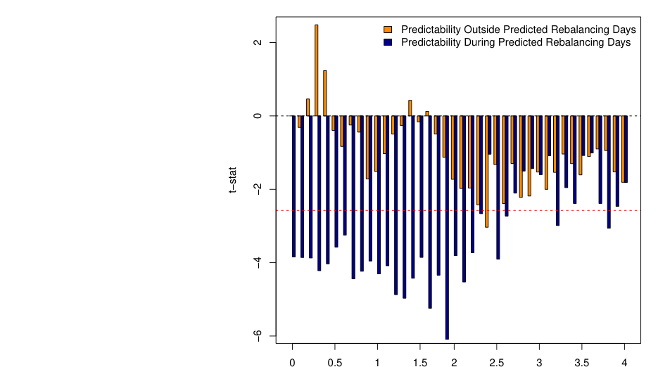

## Page 60

−0.50
−0.25
Days Ahead
Predictive Coefficients
(a) Threshold Signal
−0.50
−0.25
Days Ahead
Predictive Coefficients
(b) Calendar Signal * Week4 Dummy
Figure D.4:
Rebalancing and Horizon of Cross-Asset Return Predictability:
Non-Overlapping Returns.
This figure shows coefficient estimates and 95% heteroskedasticity-
consistent confidence intervals for threshold and calendar signals for the multivariate predictive regression
(4). We predict non-overlapping returns n days ahead, with n = 1 : 15. Daily observations. The sample
period is 1997-09-10 to 2023-03-17.
58

<!-- socr:chart-axis-residue
axis tick labels from the chart on this page; not data values.
0.00
0.25
0.50
1
2
3
4
5
6
7
8
9
10
11
12
13
14
15
0.00
0.25
0.50
1
2
3
4
5
6
7
8
9
10
11
12
13
14
15
socr:end-chart-axis-residue -->

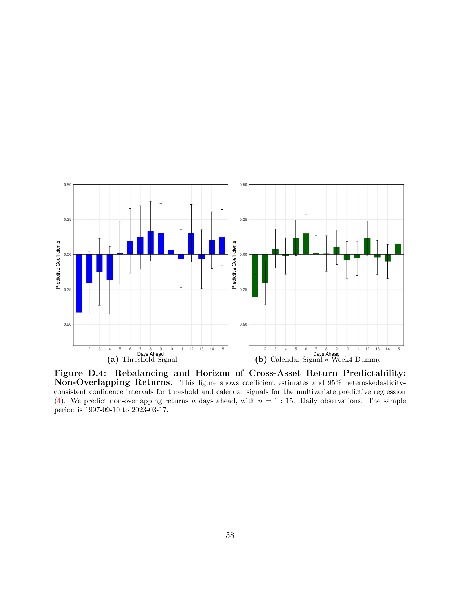

## Page 61

Figure D.5: Economic Costs of Random Monthly Rebalancing. This figure shows the distribution of economic costs for a randomly rebalanced portfolio that rebalances once per month on a randomly selected day. We simulate the strategy 10,000 times and report the resulting distribution of costs. Daily observations. The sample period is 1997-09-10 to 2023-03-17.

> **Unresolved chart placement on page 61** — the source position of chart region(s) 1 could not be located in the accepted text. The crop(s) below are preserved in source order; their position relative to the surrounding text and tables is NOT established.

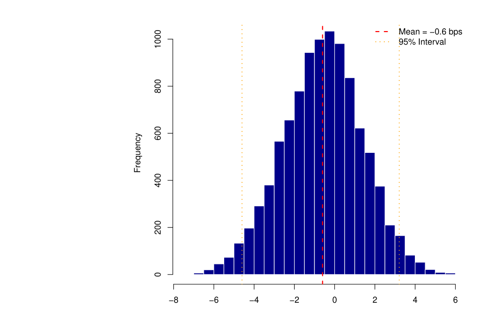

## Page 62

Table D.1: Explaining Rebalancing Signals with Trailing Returns
This table reports the estimates from regressing Threshold and Calendar on the trailing returns of S&P 500
futures in excess of the trailing returns of 10-year Treasury note futures. Threshold and Calendar signals are
constructed as described in Section 1.2. The horizon of the trailing returns is indicated in the table. Values
in parentheses are heteroskedasticity- and autocorrelation-robust standard errors. Constant estimates are
not tabulated. Daily observations. The sample period is 1997-09-10 to 2023-03-17.
Threshold Signal
Calendar Signal
1-Day Returns
0.1466∗∗∗
0.0023
(0.0100)
(0.0030)
2-Day Returns
0.0278∗∗∗
0.0041
(0.0030)
(0.0050)
3-Day Returns
0.0134∗∗∗
0.0024
(0.0040)
(0.0040)
4-Day Returns
0.0129∗∗∗
−0.0027
(0.0020)
(0.0070)
5-Day Returns
0.0177∗∗∗
0.0298∗∗∗
(0.0020)
(0.0070)
10-Day Returns
0.0145∗∗∗
0.0611∗∗∗
(0.0020)
(0.0060)
15-Day Returns
0.0051∗∗∗
0.0607∗∗∗
(0.0020)
(0.0050)
21-Day Returns
0.0061∗∗
0.0502∗∗∗
(0.0020)
(0.0070)
42-Day Returns
0.0025
0.0133∗
(0.0020)
(0.0070)
63-Day Returns
0.0001
0.0024
(0.0010)
(0.0050)
126-Day Returns
0.0000
0.0010
(0.0010)
(0.0030)
252-Day Returns
0.0020∗∗∗
0.0014
(0.0010)
(0.0020)
Adjusted R2
0.8020
0.7194
60

## Page 63

Table D.2: Cross-Asset Predictive Regressions Using HAC Covariance Matrix
This table reports estimates for the multivariate predictive regression (4). Ret is the difference between S&P
500 and 10-y Treasury note futures returns. Threshold and Calendar signals are constructed as described
in Section 1.2. Momentum is computed by averaging the sign of 11 to 20, and 21, 42, 63, 126, and 252
trailing equity returns in excess of the 10-year Treasury note.
VIX is the CBOE equity option-implied
volatility index (divided by 100); MOVE is the U.S. bond market option-implied volatility index (divided
by 100); EPU is the news-based measure of economic policy uncertainty from Baker, Bloom, and Davis
(2016); ADS is the Aruoba, Diebold, and Scotti (2009) real-time business conditions index; Sentiment is the
daily news-based sentiment index constructed in Shapiro, Sudhof, and Wilson (2022). Values in parentheses
are heteroskedasticity-and-autocorrelation-consistent standard errors. Constant estimates are not tabulated.
Daily observations. The sample period is 1997-09-10 to 2023-03-17.

[page 63 failed: unverifiable table — see image]

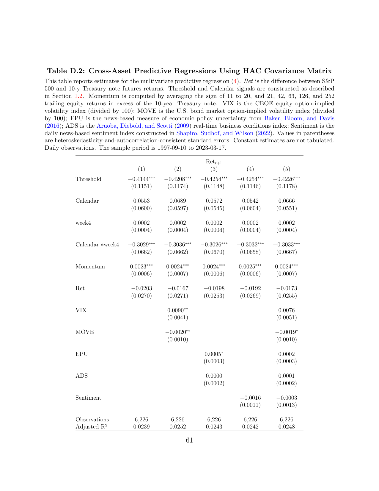

Calendar
0.0553
0.0689
0.0572
0.0542
0.0666
(0.0600)
(0.0597)
(0.0545)
(0.0604)
(0.0551)
week4
0.0002
0.0002
0.0002
0.0002
0.0002
(0.0004)
(0.0004)
(0.0004)
(0.0004)
(0.0004)
Calendar *week4
−0.3029∗∗∗
−0.3036∗∗∗
−0.3026∗∗∗
−0.3032∗∗∗
−0.3033∗∗∗
(0.0662)
(0.0662)
(0.0670)
(0.0658)
(0.0667)
Momentum
0.0023∗∗∗
0.0024∗∗∗
0.0024∗∗∗
0.0025∗∗∗
0.0024∗∗∗
(0.0006)
(0.0007)
(0.0006)
(0.0006)
(0.0007)
Ret
−0.0203
−0.0167
−0.0198
−0.0192
−0.0173
(0.0270)
(0.0271)
(0.0253)
(0.0269)
(0.0255)
VIX
0.0090∗∗
0.0076
(0.0041)
(0.0051)
MOVE
−0.0020∗∗
−0.0019∗
(0.0010)
(0.0010)
EPU
0.0005∗
0.0002
(0.0003)
(0.0003)
ADS
0.0000
0.0001
(0.0002)
(0.0002)
Sentiment
−0.0016
−0.0003
(0.0011)
(0.0013)

|  |  |  |  |  |  |
| --- | --- | --- | --- | --- | --- |
| Observations | 6,226 | 6,226 | 6,226 | 6,226 | 6,226 |
| R2 |  |  |  |  |  |
| Adjusted | 0.0239 | 0.0252 | 0.0243 | 0.0242 | 0.0248 |

61

## Page 64

Table D.3: Cross-Asset Predictive Regressions: Dissecting Momentum
This table reports estimates for the multivariate predictive regression (4). Ret is the difference between
S&P 500 and 10-year Treasury note futures returns. Threshold and Calendar signals are constructed as
described in Section 1.2. Momentum fast is calculated as the average of the signs of trailing 1 to 10 daily
excess returns; momentum medium averages the signs of 11 to 20 daily excess returns; momentum slow
averages the signs of 21, 42, 63, 126, and 252 daily excess returns. VIX is the CBOE equity option-implied
volatility index (divided by 100); MOVE is the U.S. bond market option-implied volatility index (divided
by 100); EPU is the news-based measure of economic policy uncertainty from Baker, Bloom, and Davis
(2016); ADS is the Aruoba, Diebold, and Scotti (2009) real-time business conditions index; Sentiment is the
daily news-based sentiment index constructed in Shapiro, Sudhof, and Wilson (2022). Values in parentheses
are heteroskedasticity-consistent standard errors. Constant estimates are not tabulated. Daily observations.
The sample period is 1997-09-10 to 2023-03-17.

[page 64 failed: unverifiable table — see image]

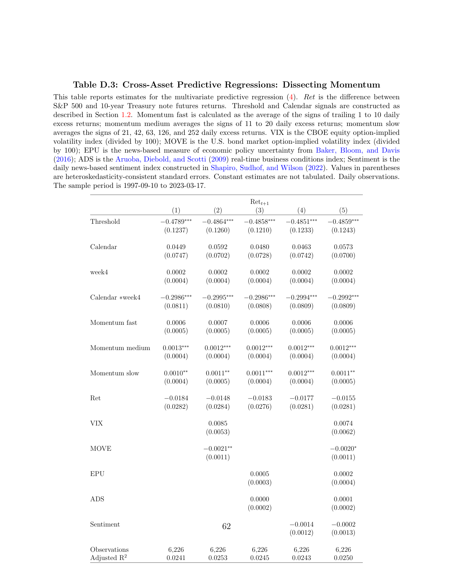

Calendar
0.0449
0.0592
0.0480
0.0463
0.0573
(0.0747)
(0.0702)
(0.0728)
(0.0742)
(0.0700)
week4
0.0002
0.0002
0.0002
0.0002
0.0002
(0.0004)
(0.0004)
(0.0004)
(0.0004)
(0.0004)
Calendar *week4
−0.2986∗∗∗
−0.2995∗∗∗
−0.2986∗∗∗
−0.2994∗∗∗
−0.2992∗∗∗
(0.0811)
(0.0810)
(0.0808)
(0.0809)
(0.0809)
Momentum fast
0.0006
0.0007
0.0006
0.0006
0.0006
(0.0005)
(0.0005)
(0.0005)
(0.0005)
(0.0005)
Momentum medium
0.0013∗∗∗
0.0012∗∗∗
0.0012∗∗∗
0.0012∗∗∗
0.0012∗∗∗
(0.0004)
(0.0004)
(0.0004)
(0.0004)
(0.0004)
Momentum slow
0.0010∗∗
0.0011∗∗
0.0011∗∗∗
0.0012∗∗∗
0.0011∗∗
(0.0004)
(0.0005)
(0.0004)
(0.0004)
(0.0005)
Ret
−0.0184
−0.0148
−0.0183
−0.0177
−0.0155
(0.0282)
(0.0284)
(0.0276)
(0.0281)
(0.0281)
VIX
0.0085
0.0074
(0.0053)
(0.0062)
MOVE
−0.0021∗∗
−0.0020∗
(0.0011)
(0.0011)
EPU
0.0005
0.0002
(0.0003)
(0.0004)
ADS
0.0000
0.0001
(0.0002)
(0.0002)
Sentiment
−0.0014
−0.0002
(0.0012)
(0.0013)

|  |  |  |  |  |  |
| --- | --- | --- | --- | --- | --- |
| Observations | 6,226 | 6,226 | 6,226 | 6,226 | 6,226 |
| R2 |  |  |  |  |  |
| Adjusted | 0.0241 | 0.0253 | 0.0245 | 0.0243 | 0.0250 |

62

## Page 65

Table D.4: Cross-Asset Predictive Regressions Using Index Returns
This table reports estimates for the multivariate predictive regression (4). Ret is the difference between S&P
500 Index and Bloomberg Aggregate Bond Index returns. Threshold and Calendar signals are constructed as
described in Section 1.2. Momentum is computed by averaging the sign of 11 to 20, and 21, 42, 63, 126, and
252 trailing equity returns in excess of the 10-year Treasury note. VIX is the CBOE equity option-implied
volatility index (divided by 100); MOVE is the U.S. bond market option-implied volatility index (divided
by 100); EPU is the news-based measure of economic policy uncertainty from Baker, Bloom, and Davis
(2016); ADS is the Aruoba, Diebold, and Scotti (2009) real-time business conditions index; Sentiment is the
daily news-based sentiment index constructed in Shapiro, Sudhof, and Wilson (2022). Values in parentheses
are heteroskedasticity-consistent standard errors. Daily observations. The sample period is 1997-09-10 to
2023-03-17.

[page 65 failed: unverifiable table — see image]

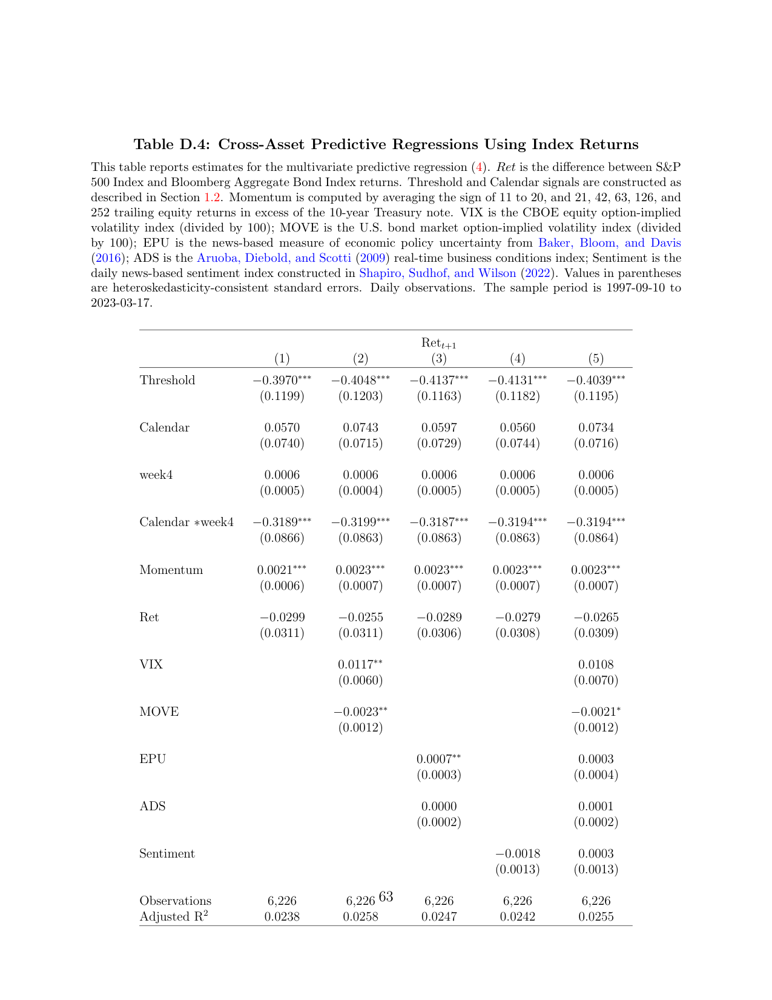

Calendar
0.0570
0.0743
0.0597
0.0560
0.0734
(0.0740)
(0.0715)
(0.0729)
(0.0744)
(0.0716)
week4
0.0006
0.0006
0.0006
0.0006
0.0006
(0.0005)
(0.0004)
(0.0005)
(0.0005)
(0.0005)
Calendar *week4
−0.3189∗∗∗
−0.3199∗∗∗
−0.3187∗∗∗
−0.3194∗∗∗
−0.3194∗∗∗
(0.0866)
(0.0863)
(0.0863)
(0.0863)
(0.0864)
Momentum
0.0021∗∗∗
0.0023∗∗∗
0.0023∗∗∗
0.0023∗∗∗
0.0023∗∗∗
(0.0006)
(0.0007)
(0.0007)
(0.0007)
(0.0007)
Ret
−0.0299
−0.0255
−0.0289
−0.0279
−0.0265
(0.0311)
(0.0311)
(0.0306)
(0.0308)
(0.0309)
VIX
0.0117∗∗
0.0108
(0.0060)
(0.0070)
MOVE
−0.0023∗∗
−0.0021∗
(0.0012)
(0.0012)
EPU
0.0007∗∗
0.0003
(0.0003)
(0.0004)
ADS
0.0000
0.0001
(0.0002)
(0.0002)
Sentiment
−0.0018
0.0003
(0.0013)
(0.0013)

|  |  |  | 63 |  |  |  |
| --- | --- | --- | --- | --- | --- | --- |
| Observations | 6,226 | 6,226 |  | 6,226 | 6,226 | 6,226 |
| R2 |  |  |  |  |  |  |
| Adjusted | 0.0238 | 0.0258 |  | 0.0247 | 0.0242 | 0.0255 |

## Page 66

Table D.5: Cross-Asset Predictive Regressions Using Changes
This table reports estimates for the multivariate predictive regression (4). Ret is the difference between S&P
500 and 10-year Treasury note futures returns. Threshold and Calendar signals are constructed as described
in Section 1.2. Momentum is computed by averaging the sign of 11 to 20, and 21, 42, 63, 126, and 252 trailing
equity returns in excess of the 10-year Treasury note. All control variables are expressed in changes. VIX is
the CBOE equity option-implied volatility index (divided by 100); MOVE is the U.S. bond market option-
implied volatility index (divided by 100); EPU is the news-based measure of economic policy uncertainty
from Baker, Bloom, and Davis (2016); ADS is the Aruoba, Diebold, and Scotti (2009) real-time business
conditions index; Sentiment is the daily news-based sentiment index constructed in Shapiro, Sudhof, and
Wilson (2022). Values in parentheses are heteroskedasticity-consistent standard errors. Daily observations.
The sample period is 1997-09-10 to 2023-03-17.
Rett+1
(1)
(2)
(3)
(4)
Threshold
−0.4049∗∗∗
−0.4217∗∗∗
−0.4122∗∗∗
−0.4103∗∗∗
(0.1148)
(0.1135)
(0.1152)
(0.1136)
Calendar
0.0570
0.0570
0.0557
0.0589
(0.0709)
(0.0687)
(0.0708)
(0.0685)
week4
0.0002
0.0002
0.0002
0.0002
(0.0004)
(0.0004)
(0.0004)
(0.0004)
Calendar *week4
−0.3048∗∗∗
−0.3024∗∗∗
−0.3029∗∗∗
−0.3043∗∗∗
(0.0812)
(0.0806)
(0.0808)
(0.0810)
Momentum
0.0023∗∗∗
0.0023∗∗∗
0.0023∗∗∗
0.0023∗∗∗
(0.0006)
(0.0006)
(0.0006)
(0.0006)
Ret
0.0031
−0.0179
−0.0207
0.0057
(0.0463)
(0.0283)
(0.0289)
(0.0461)
∆VIX
0.0191
0.0196
(0.0367)
(0.0375)
∆MOVE
0.0135∗
0.0138∗
(0.0071)
(0.0072)
∆EPU
−0.0006
−0.0006∗
(0.0004)
(0.0004)
∆ADS
−0.0010
−0.0010
(0.0039)
(0.0040)

[page 66 failed: unverifiable table — see image]

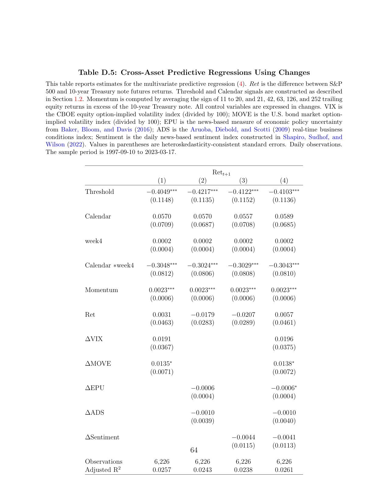

## Page 67

[page 67 failed: unverifiable table — see image]

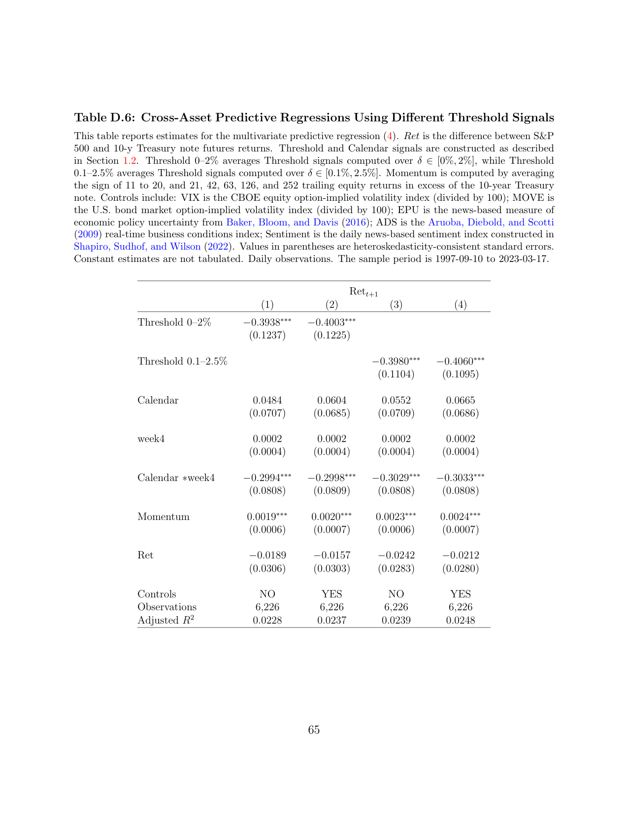

## Page 68

Table D.7: Cross-Asset Predictive Regressions: Different Portfolio Weights

This table reports estimates for the multivariate predictive regression (4). $Ret$ is the difference between S&P 500 and 10-year Treasury note futures returns. Threshold and Calendar signals are constructed as described in Section 1.2. Momentum is computed by averaging the sign of 11 to 20, and 21, 42, 63, 126, and 252 trailing equity returns in excess of the 10-year Treasury note. Values in parentheses are heteroskedasticity-consistent standard errors. Daily observations. The sample period is 1997-09-10 to 2023-03-17.

| equity-bond Allocation | Ret$_{t+1}$ | | |
| :--- | :--- | :--- | :--- |
| | **86/14** | **50/50** | **70/30** |
| Threshold | -0.8453*** | -0.4098*** | -0.4822*** |
| | (0.212) | (0.107) | (0.131) |
| Calendar | 0.1021 | 0.0522 | 0.0622 |
| | (0.143) | (0.066) | (0.081) |
| week4 | 0.0001 | 0.0002 | 0.0001 |
| | (0.000) | (0.000) | (0.000) |
| Calendar × week4 | -0.6008*** | -0.2914*** | -0.3460*** |
| | (0.160) | (0.076) | (0.091) |
| Momentum | 0.0023*** | 0.0023*** | 0.0024*** |
| | (0.001) | (0.001) | (0.001) |
| Ret | -0.0177 | -0.0186 | -0.0191 |
| | (0.027) | (0.029) | (0.029) |
| Observations | 6,226 | 6,226 | 6,226 |
| Adjusted $R^2$ | 0.025 | 0.024 | 0.025 |

## Page 69

[page 69 failed: unverifiable table — see image]

## Page 70

Table D.9: Cross-Asset Predictive Regressions: Alternative Controls

This table reports estimates for the multivariate predictive regression (4). $Ret$ is the difference between S&P 500 and 10-year Treasury note futures returns. Threshold and Calendar signals are constructed as described in Section 1.2. Momentum is computed by averaging the sign of 11 to 20, and 21, 42, 63, 126, and 252 trailing equity returns in excess of the 10-year Treasury note. ra$^{BEX}$ and unc$^{BEX}$ are, respectively, the risk aversion and economic uncertainty indexes costructed in Bekaert, Engstrom, and Xu (2022); FEARS is the Financial and Economic Attitudes Revealed by Search index constructed in Da, Engelberg, and Gao (2015) available from 2004-07-01 to 2016-12-30; ARA is the aggregate retail attention index constructed in Da et al. (2025) available from 2004-07-01 to 2019-12-31. Values in parentheses are heteroskedasticity-consistent standard errors. Daily observations.

| | (1) | (2) | (3) | (4) |
| :--- | :--- | :--- | :--- | :--- |
| | $Ret_{t+1}$ | | | |
| Threshold | $-0.4493^{***}$ | $-0.4375^{***}$ | $-0.4226^{**}$ | $-0.3731^{**}$ |
| | $(0.1152)$ | $(0.1134)$ | $(0.1719)$ | $(0.1537)$ |
| Calendar | $0.1059^{*}$ | $0.0599$ | $0.1000$ | $0.1100$ |
| | $(0.0616)$ | $(0.0704)$ | $(0.1134)$ | $(0.0980)$ |
| week4 | $0.0001$ | $0.0001$ | $0.0003$ | $0.0003$ |
| | $(0.0004)$ | $(0.0004)$ | $(0.0006)$ | $(0.0005)$ |
| Calendar *week4 | $-0.3048^{***}$ | $-0.3075^{***}$ | $-0.4011^{***}$ | $-0.3823^{***}$ |
| | $(0.0807)$ | $(0.0813)$ | $(0.1309)$ | $(0.1173)$ |
| Momentum | $0.0025^{***}$ | $0.0026^{***}$ | $0.0020^{**}$ | $0.0016^{**}$ |
| | $(0.0006)$ | $(0.0007)$ | $(0.0010)$ | $(0.0008)$ |
| Ret | $-0.0115$ | $-0.0208$ | $-0.0087$ | $-0.0223$ |
| | $(0.0289)$ | $(0.0290)$ | $(0.0389)$ | $(0.0350)$ |
| ra$^{BEX}$ | $0.0009$ | | | |
| | $(0.0006)$ | | | |
| unc$^{BEX}$ | | $0.0007$ | | |
| | | $(0.0007)$ | | |
| FEARS | | | $0.0009$ | |
| | | | $(0.0007)$ | |
| ARA | | | | $0.0001$ |
| | | | | $(0.0060)$ |
| Observations | 6,124 | 6,124 | 3,149 | 3,903 |
| Adjusted R$^2$ | 0.0300 | 0.0249 | 0.0298 | 0.0270 |

68

## Page 71

Table D.10: Cross-Asset Predictive Regressions: The Role of Reversal
This table reports estimates for the multivariate predictive regression (4). Ret is the difference between S&P
500 and 10-year Treasury note futures returns. Threshold and Calendar signals are constructed as described
in Section 1.2. Momentum is computed by averaging the sign of 11 to 20, and 21, 42, 63, 126, and 252 trailing
equity returns in excess of the 10-year Treasury note. Short-Term Reversal are the trailing 5−day returns;
Long-Term Reversal are the trailing 5−year (i.e., 1260 days) returns with the last year skipped. Values in
parentheses are heteroskedasticity-consistent standard errors. Constant estimates are not tabulated. Daily
observations. The sample period is 1997-09-10 to 2023-03-17.
Rett+1
(1)
(2)
(3)
(4)
(5)
Threshold
−0.4313∗∗∗
−0.5644∗∗∗
−0.5446∗∗∗
(0.1256)
(0.1140)
(0.1542)
Calendar
0.0694
0.0632
0.0691
(0.0707)
(0.0840)
(0.0839)
week4
0.0001
0.0001
0.0001
(0.0004)
(0.0005)
(0.0005)
Calendar *week4
−0.3077∗∗∗
−0.2835∗∗∗
−0.2858∗∗∗
(0.0814)
(0.0966)
(0.0978)
Momentum
0.0024∗∗∗
0.0025∗∗∗
0.0025∗∗∗
(0.0006)
(0.0007)
(0.0008)
Short-Term Reversal
−0.0377∗∗∗
−0.0122
−0.0054
(0.0136)
(0.0195)
(0.0236)
Long-Term Reversal
−0.0004
−0.0001
−0.0001
(0.0004)
(0.0004)
(0.0004)

[page 71 failed: unverifiable table — see image]

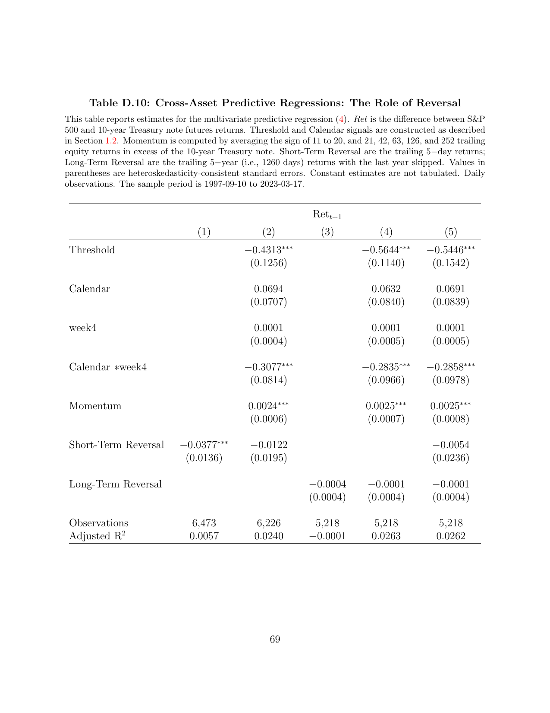

69

## Page 72

Table D.11: Cross-Asset Predictive Regressions: End-of-Month Reversal

[page 72 failed: unverifiable table — see image]

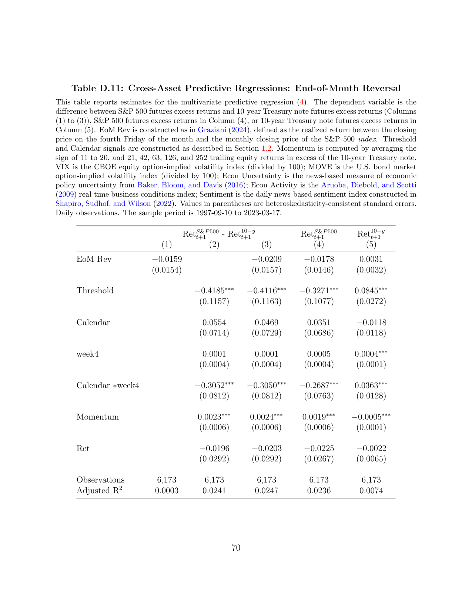

This table reports estimates for the multivariate predictive regression (4). The dependent variable is the
difference between S&P 500 futures excess returns and 10-year Treasury note futures excess returns (Columns
(1) to (3)), S&P 500 futures excess returns in Column (4), or 10-year Treasury note futures excess returns in
price on the fourth Friday of the month and the monthly closing price of the S&P 500 index. Threshold
and Calendar signals are constructed as described in Section 1.2. Momentum is computed by averaging the
sign of 11 to 20, and 21, 42, 63, 126, and 252 trailing equity returns in excess of the 10-year Treasury note.
VIX is the CBOE equity option-implied volatility index (divided by 100); MOVE is the U.S. bond market
option-implied volatility index (divided by 100); Econ Uncertainty is the news-based measure of economic
policy uncertainty from Baker, Bloom, and Davis (2016); Econ Activity is the Aruoba, Diebold, and Scotti
Shapiro, Sudhof, and Wilson (2022). Values in parentheses are heteroskedasticity-consistent standard errors.
Daily observations. The sample period is 1997-09-10 to 2023-03-17.
Threshold
Momentum
Observations
70

## Page 73

Table D.12: Cross-Asset Predictive Regressions: Calendar Effects Across Weeks
This table reports estimates for the multivariate predictive regression (4). Ret is the difference between S&P
500 and 10-y Treasury note futures returns. Threshold and Calendar signals are constructed as described in
Section 1.2. Momentum is computed by averaging the sign of 11 to 20, and 21, 42, 63, 126, and 252 trailing
equity returns in excess of the 10-year Treasury note. Values in parentheses are heteroskedasticity-consistent
standard errors. Constant estimates are not tabulated. Daily observations. The sample period is 1997-09-10
to 2023-03-17.

[page 73 failed: unverifiable table — see image]

Rett+1
Calendar
−0.1000∗
−0.0692
−0.1529∗∗
0.0357
0.1240∗
−0.0101
(0.0604)
(0.0587)
(0.0618)
(0.0784)
(0.0729)
(0.0910)
week1
0.0007
0.0009∗
(0.0004)
(0.0005)
Calendar *week1
0.2262∗∗
0.1109
(0.1018)
(0.1099)
week2
0.0002
0.0004
(0.0004)
(0.0005)
Calendar *week2
−0.0500
−0.2195∗
(0.1123)
(0.1177)
week3
−0.0012∗∗∗
−0.0013∗∗∗
(0.0005)
(0.0005)
Calendar *week3
0.2579∗∗∗
0.1305
(0.0887)
(0.1065)
week4
0.0004
0.0003
−0.0002
(0.0005)
(0.0005)
(0.0005)
Calendar *week4
−0.2831∗∗∗
−0.3745∗∗∗
−0.2401∗∗
(0.0866)
(0.0843)
(0.0978)
Momentum
0.0021∗∗∗
0.0021∗∗∗
0.0022∗∗∗
0.0023∗∗∗
0.0022∗∗∗
0.0023∗∗∗
(0.0006)
(0.0006)
(0.0006)
(0.0006)
(0.0006)
(0.0006)
Ret
−0.0247
−0.0202
−0.0195
−0.0230
−0.0261
−0.0198
(0.0290)
(0.0292)
(0.0291)
(0.0291)
(0.0290)
(0.0290)
Observations
6,226
6,226
6,226
6,226
6,226
6,226
Adjusted R2
0.0161
0.0129
0.0211
0.0249
0.0273
0.0261
71

## Page 74

[page 74 failed: unverifiable table — see image]

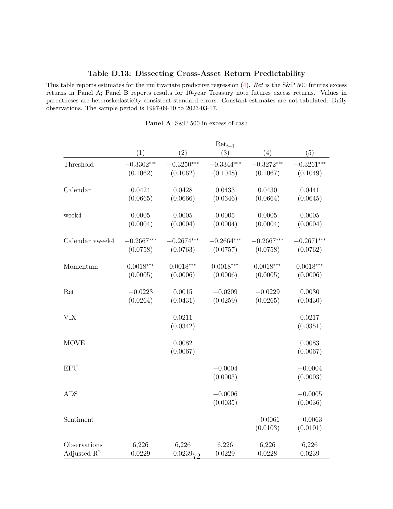

## Page 75

Panel B: 10-year Treasury note in excess of cash

| | (1) | (2) | (3) | (4) | (5) |
| :--- | :--- | :--- | :--- | :--- | :--- |
| Threshold | $0.0842^{***}$ | $0.0799^{***}$ | $0.0873^{***}$ | $0.0850^{***}$ | $0.0841^{***}$ |
| | $(0.0269)$ | $(0.0269)$ | $(0.0270)$ | $(0.0270)$ | $(0.0270)$ |
| Calendar | $-0.0129$ | $-0.0141$ | $-0.0137$ | $-0.0127$ | $-0.0148$ |
| | $(0.0116)$ | $(0.0116)$ | $(0.0114)$ | $(0.0116)$ | $(0.0113)$ |
| week4 | $0.0004^{***}$ | $0.0004^{***}$ | $0.0004^{***}$ | $0.0004^{***}$ | $0.0004^{***}$ |
| | $(0.0001)$ | $(0.0001)$ | $(0.0001)$ | $(0.0001)$ | $(0.0001)$ |
| Calendar *week4 | $0.0362^{***}$ | $0.0374^{***}$ | $0.0360^{***}$ | $0.0362^{***}$ | $0.0372^{***}$ |
| | $(0.0128)$ | $(0.0128)$ | $(0.0127)$ | $(0.0128)$ | $(0.0127)$ |
| Momentum | $-0.0005^{***}$ | $-0.0005^{***}$ | $-0.0005^{***}$ | $-0.0005^{***}$ | $-0.0005^{***}$ |
| | $(0.0001)$ | $(0.0001)$ | $(0.0001)$ | $(0.0001)$ | $(0.0001)$ |
| Ret | $-0.0020$ | $-0.0015$ | $-0.0030$ | $-0.0022$ | $-0.0027$ |
| | $(0.0065)$ | $(0.0093)$ | $(0.0064)$ | $(0.0065)$ | $(0.0093)$ |
| VIX | | $0.0020$ | | | $0.0020$ |
| | | $(0.0067)$ | | | $(0.0066)$ |
| MOVE | | $-0.0054^{***}$ | | | $-0.0055^{***}$ |
| | | $(0.0017)$ | | | $(0.0017)$ |
| EPU | | | $0.0002^{***}$ | | $0.0003^{***}$ |
| | | | $(0.0001)$ | | $(0.0001)$ |
| ADS | | | $0.0005$ | | $0.0005$ |
| | | | $(0.0006)$ | | $(0.0007)$ |
| Sentiment | | | | $-0.0017$ | $-0.0021$ |
| | | | | $(0.0031)$ | $(0.0031)$ |
| Observations | 6,226 | 6,226 | 6,226 | 6,226 | 6,226 |
| Adjusted R² | 0.0074 | 0.0102 | 0.0087 | 0.0072 | 0.0117 |

## Page 76

Table D.14: Cross-Asset Predictive Regressions: International Equity

This table reports estimates for the multivariate predictive regression (4) for international equity returns. $Ret$ is the difference between MSCI ACWI ex U.S. Index and the U.S. 3-month Treasury bill. Threshold and Calendar signals are constructed as described in Section 1.2. Momentum is computed by averaging the sign of 11 to 20, and 21, 42, 63, 126, and 252 trailing equity returns in excess of the 10-year Treasury note. VIX is the CBOE equity option-implied volatility index (divided by 100); MOVE is the U.S. bond market option-implied volatility index (divided by 100); EPU is the news-based measure of economic policy uncertainty from Baker, Bloom, and Davis (2016); ADS is the Aruoba, Diebold, and Scotti (2009) real-time business conditions index; Sentiment is the daily news-based sentiment index constructed in Shapiro, Sudhof, and Wilson (2022). Values in parentheses are heteroskedasticity-consistent standard errors. Constant estimates are not tabulated. Daily observations. The sample period is 1997-09-10 to 2023-03-17.

| | (1) | (2) | (3) | (4) | (5) |
| :--- | :--- | :--- | :--- | :--- | :--- |
| | $Ret_{t+1}$ | | | | |
| Threshold | $-0.2723^{***}$ | $-0.2773^{***}$ | $-0.2738^{***}$ | $-0.2766^{***}$ | $-0.2749^{***}$ |
| | $(0.0870)$ | $(0.0857)$ | $(0.0870)$ | $(0.0868)$ | $(0.0865)$ |
| Calendar | $0.0810^{*}$ | $0.0855^{**}$ | $0.0810^{*}$ | $0.0801^{*}$ | $0.0818^{*}$ |
| | $(0.0453)$ | $(0.0427)$ | $(0.0447)$ | $(0.0457)$ | $(0.0433)$ |
| week4 | $0.0007^{**}$ | $0.0007^{**}$ | $0.0007^{**}$ | $0.0007^{**}$ | $0.0007^{**}$ |
| | $(0.0003)$ | $(0.0003)$ | $(0.0003)$ | $(0.0003)$ | $(0.0003)$ |
| Calendar *week4 | $-0.2060^{***}$ | $-0.2055^{***}$ | $-0.2056^{***}$ | $-0.2061^{***}$ | $-0.2055^{***}$ |
| | $(0.0535)$ | $(0.0539)$ | $(0.0536)$ | $(0.0535)$ | $(0.0539)$ |
| Momentum | $0.0004$ | $0.0003$ | $0.0004$ | $0.0005$ | $0.0003$ |
| | $(0.0003)$ | $(0.0004)$ | $(0.0003)$ | $(0.0003)$ | $(0.0004)$ |
| 2-day Trailing Returns | $0.0708^{***}$ | $0.0727^{***}$ | $0.0703^{***}$ | $0.0710^{***}$ | $0.0707^{***}$ |
| | $(0.0145)$ | $(0.0141)$ | $(0.0145)$ | $(0.0145)$ | $(0.0143)$ |
| VIX | | $0.0035$ | | | $0.0011$ |
| | | $(0.0043)$ | | | $(0.0047)$ |
| MOVE | | $-0.0014^{*}$ | | | $-0.0011$ |
| | | $(0.0008)$ | | | $(0.0009)$ |
| EPU | | | $0.0005^{**}$ | | $0.0004$ |
| | | | $(0.0002)$ | | $(0.0003)$ |
| ADS | | | $0.0001$ | | $0.0001$ |
| | | | $(0.0002)$ | | $(0.0002)$ |
| Sentiment | | | | $-0.0008$ | $-0.0001$ |
| | | | | $(0.0009)$ | $(0.0009)$ |
| Observations | 6,097 | 6,097 | 6,097 | 6,097 | 6,097 |
| Adjusted R² | 0.0255 | 0.0262 | 0.0263 | 0.0255 | 0.0265 |
